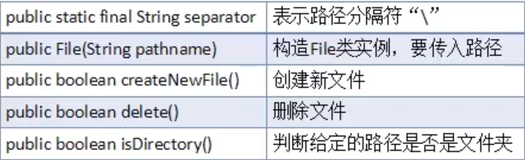
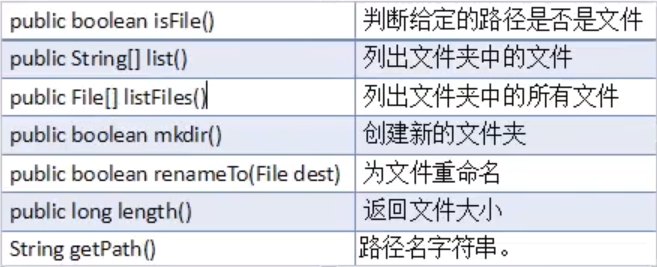

# javaSE之IO
## 文件与IO_File类的使用

~~~java
//创建一个文件对象，路径为"d:/test/Demo.txt"
        File f1 = new File("d:/test/Demo.txt");
        if(!f1.exists()){//判断文件是否存在
            try{
                //文件不存在，使用createNewFile()创建文件
                f1.createNewFile();
                System.out.println("文件创建成功");
            } catch (IOException e){
                e.printStackTrace();
            }

        }
        //判断是否为文件
        System.out.println(f1.isFile());
        //判断是否为文件夹
        System.out.println(f1.isDirectory());

        File f2 = new File("d:/test");
        //删除文件返回的值为boolean值
        //如果删除文件夹，文件夹里有文件，那就会删除失败
        System.out.println(f2.delete());

        //返回当前目录下的所有文件名
        String[] names = f2.list();
        System.out.println(Arrays.toString(names));
        //列出当前目录下所有文件，以file对象返回
        File[] fs=f2.listFiles();
        for (File f:fs) {
            System.out.println(f.getName());//文件名
            System.out.println(f.length());//文件大小
            System.out.println(f.getPath());//相对路径
            System.out.println(f.getAbsolutePath());//绝对路径
            System.out.println(f.isHidden());//是否为隐藏文件
            Date date = new Date(f.lastModified());
            DateFormat df = new SimpleDateFormat("HH:mm:ss");
            System.out.println(df.format(date));//文件最后一次修改时间
        }

        File f3 = new File("temp.txt");//相对路径,对于这个项目而言的路径
        File f4 =new File("d:/test/test1");
        //一次性创建一连串文件夹
        //f4.mkdirs();
        //一次性创建一个文件夹
        f4.mkdir();
        //重命名与移动文件
        f4.renameTo(new File("d:/test/test2"));

        File f5 = new File("d:/test/test3");
        //FileFilter() 用于自定义找出改目录下你选择的文件，过滤器
        File[] files = f5.listFiles(new FileFilter() {
            @Override
            public boolean accept(File pathname) {
                return pathname.getName().endsWith(".txt");
            }
        });
        for (File file:files) {
            System.out.println(file.getName());
        }

        //也可以用lambda表达式：
        File[] files1 = f5.listFiles((pathname)->pathname.getName().endsWith(".xls"));
        for (File file:files1) {
            System.out.println(file.getName());
        }
~~~

