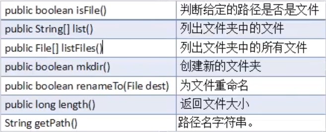
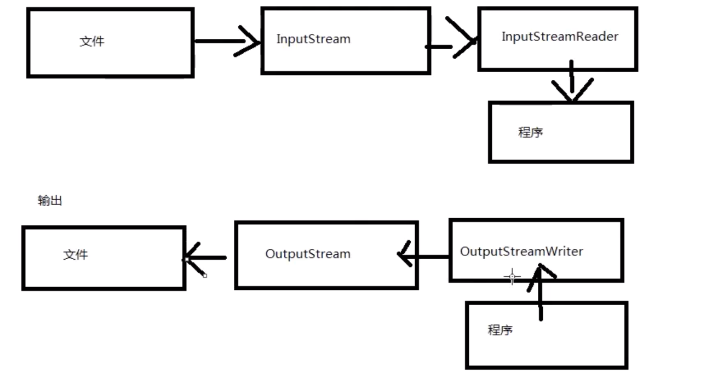

# javaSE之IO
## File类的使用

~~~java
        //创建一个文件对象，路径为"d:/test/Demo.txt"
        File f1 = new File("d:/test/Demo.txt");
        if(!f1.exists()){//判断文件是否存在
            try{
                //文件不存在，使用createNewFile()创建文件
                f1.createNewFile();
                System.out.println("文件创建成功");
            } catch (IOException e){
                e.printStackTrace();
            }

        }
        //判断是否为文件
        System.out.println(f1.isFile());
        //判断是否为文件夹
        System.out.println(f1.isDirectory());

        File f2 = new File("d:/test");
        //删除文件返回的值为boolean值
        //如果删除文件夹，文件夹里有文件，那就会删除失败
        System.out.println(f2.delete());

        //返回当前目录下的所有文件名
        String[] names = f2.list();
        System.out.println(Arrays.toString(names));
        //列出当前目录下所有文件，以file对象返回
        File[] fs=f2.listFiles();
        for (File f:fs) {
            System.out.println(f.getName());//文件名
            System.out.println(f.length());//文件大小
            System.out.println(f.getPath());//相对路径
            System.out.println(f.getAbsolutePath());//绝对路径
            System.out.println(f.isHidden());//是否为隐藏文件
            Date date = new Date(f.lastModified());
            DateFormat df = new SimpleDateFormat("HH:mm:ss");
            System.out.println(df.format(date));//文件最后一次修改时间
        }

        File f3 = new File("temp.txt");//相对路径,对于这个项目而言的路径
        File f4 =new File("d:/test/test1");
        //一次性创建一连串文件夹
        //f4.mkdirs();
        //一次性创建一个文件夹
        f4.mkdir();
        //重命名与移动文件
        f4.renameTo(new File("d:/test/test2"));

        File f5 = new File("d:/test/test3");
        //FileFilter() 用于自定义找出改目录下你选择的文件，过滤器
        File[] files = f5.listFiles(new FileFilter() {
            @Override
            public boolean accept(File pathname) {
                return pathname.getName().endsWith(".txt");
            }
        });
        for (File file:files) {
            System.out.println(file.getName());
        }

        //也可以用lambda表达式：
        File[] files1 = f5.listFiles((pathname)->pathname.getName().endsWith(".xls"));
        for (File file:files1) {
            System.out.println(file.getName());
        }


/**
     * 该方法用于查找目标目录下所有指定类型的文件
     * @param target ：目标目录
     * @param end   ：查找的类型
     */
    static void findFile(File target,String end){
        if(target == null)return;
        if(target.isDirectory()){
            File[] files = target.listFiles();
            if(files != null){
                for (File file:files) {
                    findFile(file,end);
                }
            }
        }else{
            String name = target.getName().toLowerCase();
            if(name.endsWith(end)){
                System.out.println(target.getAbsolutePath());
            }
        }
    }
~~~





## 字节字符输入输出流

### 字节输入输出流

~~~java
/**字节流
 * 输入输出超类：OutputStream、IntputStream
 * 对文件输入输出使用：FileOutputStream、FileIntputStream
 * 输入输入流操作原理，每次只会操作一个字节
 * 字节操作流，默认每次执行写入操作会直接把数据写入文件
 * 只有操作文本文件才使用字符流
 */
public class WWW_Demo1 {
    public static void out()  {
        //确定目标文件
        File file= new File("D:\\test\\test4\\test.txt");

        try{
            //构建一个文件输出对象
            OutputStream out = new FileOutputStream(file,false);//append为true表示追加内容，默认为覆盖
            //输出内容
            String str = "小明在学校";
            //将内容以字节数组的方式写入文件
            out.write(str.getBytes());
            //关闭流
            out.close();
            System.out.println("写入成功");
        }catch (FileNotFoundException e){
            e.printStackTrace();
        } catch (IOException e) {
            e.printStackTrace();
        }
    }

    public static void in(){
        //确定目标文件
        File file= new File("D:\\test\\test4\\test.txt");

        try{
            //构建一个文件输入对象
            InputStream in = new FileInputStream(file);
            //数组用于每次处理的字节长度（1024为最大长度）
            byte[] bytes = new byte[20];
            StringBuilder buf = new StringBuilder();
            int len = -1;//表示每次被读取的字节长度
            //把数据读取到数组中，并返回读取的字节数，表示读取到数据，等于-1表示文件已经去读取完毕
            while((len = in.read(bytes))!=-1){
                //根据读取到的字节数组，转换为字符串,len用来去除每次录入的多余的或者空的字节
                buf.append(new String(bytes,0,len));
            }
            System.out.println(buf);
            //关闭流
            in.close();

        }catch (FileNotFoundException e){
            e.printStackTrace();
        } catch (IOException e) {
            e.printStackTrace();
        }
    }

    public static void main(String[] args) {
        out();
        in();
    }
}
~~~

### 字符输入输出流

~~~java 
/**
 * 字符流
 * 字符的输入输出超类：Writer,Reader
 * 字符的对文件输入输出使用：FileWriter、FileReader
 * 每次操作的单位是一个字符
 * 文件字符操作流自带缓存，默认大小为1024字节，在缓存满后、或者刷新、关闭流是会把数据写入文件
 */
public class WWW_Demo2 {
    public static void out() {
        //确定目标文件
        File file = new File("D:\\test\\test4\\test.txt");

        try {
            Writer out = new FileWriter(file);
            out.write("你是我的神");
            out.close();
            System.out.println("写入成功");
        } catch (FileNotFoundException e) {
            e.printStackTrace();
        } catch (IOException e) {
            e.printStackTrace();
        }
    }
    public static void in() {
        //确定目标文件
        File file = new File("D:\\test\\test4\\test.txt");

        try {
            Reader in = new FileReader(file);
            char[] cs = new char[20];
            int len = in.read(cs);
            StringBuilder buf = new StringBuilder();
            while(len!=-1){
                buf.append(new String(cs,0,len));
                len = in.read(cs);
            }
            in.close();
            System.out.println(buf);
        } catch (FileNotFoundException e) {
            e.printStackTrace();
        } catch (IOException e) {
            e.printStackTrace();
        }
    }
    public static void main(String[] args) {
        out();
        in();
    }
}

~~~

### 文件copy例子

```
public static boolean copy(String src, String target){
    File srcFile = new File(src);
    File targetFile = new File(target);
    try{
        InputStream in = new FileInputStream(srcFile);
        OutputStream out = new FileOutputStream(targetFile);
        byte[] bytes = new byte[1024];
        int len = in.read(bytes);
        while(len!=-1){
            out.write(bytes,0,len);
            len = in.read(bytes);
        }
        in.close();
        out.close();
        return true;
    } catch (FileNotFoundException e) {
        e.printStackTrace();
    } catch (IOException e) {
        e.printStackTrace();
    }
    return false;
}
```

## 字节字符转换流

~~~java
/**
 * 转换流
 * OutputStreamWriter,可以将输出的字符转换为字节流的输出形式
 * InputStreamReader,将输入的字节流转换为字符流输入形式
 */
public class WWW_Demo4 {

    public static void read(InputStream in) {
        Reader reader = new InputStreamReader(in, Charset.forName("UTF-8"));
        char[] cs = new char[20];
        try {
            int len = reader.read(cs);
            while (len != -1) {
                System.out.println(new String(cs, 0, len));
                len = reader.read(cs);
            }
            reader.close();
        } catch (IOException e) {
            e.printStackTrace();
        }

    }

    public static void write(OutputStream out) {
        Writer writer = new OutputStreamWriter(out);
        try {
            writer.write("村花到我家");
            System.out.println("写入成功");
            writer.close();
        } catch (IOException e) {
            e.printStackTrace();
        }

    }

    public static void main(String[] args) throws FileNotFoundException {
        InputStream in = new FileInputStream("D:\\test\\Demo.txt");
        read(in);
        OutputStream out = new FileOutputStream("D:\\test\\Demo.txt");
        write(out);
    }
}

~~~




## 字节、字符缓冲流

