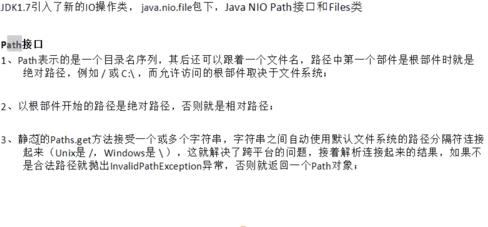
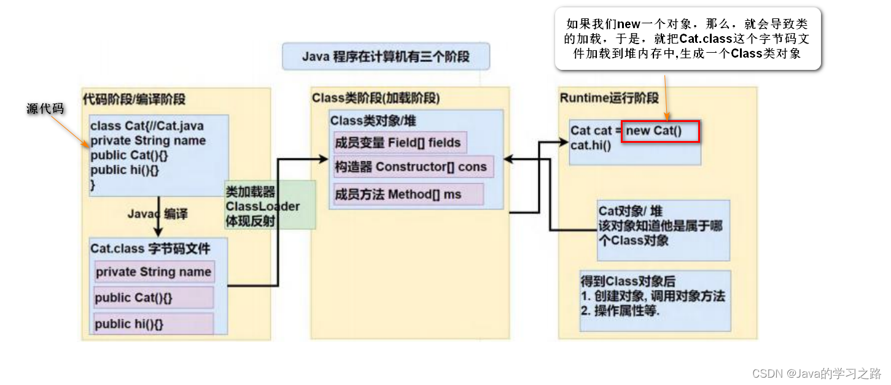

# javaSE之IO


## File类的使用

~~~java
        //创建一个文件对象，路径为"d:/test/Demo.txt"
        File f1 = new File("d:/test/Demo.txt");
        if(!f1.exists()){//判断文件是否存在
            try{
                //文件不存在，使用createNewFile()创建文件
                f1.createNewFile();
                System.out.println("文件创建成功");
            } catch (IOException e){
                e.printStackTrace();
            }

        }
        //判断是否为文件
        System.out.println(f1.isFile());
        //判断是否为文件夹
        System.out.println(f1.isDirectory());

        File f2 = new File("d:/test");
        //删除文件返回的值为boolean值
        //如果删除文件夹，文件夹里有文件，那就会删除失败
        System.out.println(f2.delete());

        //返回当前目录下的所有文件名
        String[] names = f2.list();
        System.out.println(Arrays.toString(names));
        //列出当前目录下所有文件，以file对象返回
        File[] fs=f2.listFiles();
        for (File f:fs) {
            System.out.println(f.getName());//文件名
            System.out.println(f.length());//文件大小
            System.out.println(f.getPath());//相对路径
            System.out.println(f.getAbsolutePath());//绝对路径
            System.out.println(f.isHidden());//是否为隐藏文件
            Date date = new Date(f.lastModified());
            DateFormat df = new SimpleDateFormat("HH:mm:ss");
            System.out.println(df.format(date));//文件最后一次修改时间
        }

        File f3 = new File("temp.txt");//相对路径,对于这个项目而言的路径
        File f4 =new File("d:/test/test1");
        //一次性创建一连串文件夹
        //f4.mkdirs();
        //一次性创建一个文件夹
        f4.mkdir();
        //重命名与移动文件
        f4.renameTo(new File("d:/test/test2"));

        File f5 = new File("d:/test/test3");
        //FileFilter() 用于自定义找出改目录下你选择的文件，过滤器
        File[] files = f5.listFiles(new FileFilter() {
            @Override
            public boolean accept(File pathname) {
                return pathname.getName().endsWith(".txt");
            }
        });
        for (File file:files) {
            System.out.println(file.getName());
        }

        //也可以用lambda表达式：
        File[] files1 = f5.listFiles((pathname)->pathname.getName().endsWith(".xls"));
        for (File file:files1) {
            System.out.println(file.getName());
        }


/**
     * 该方法用于查找目标目录下所有指定类型的文件
     * @param target ：目标目录
     * @param end   ：查找的类型
     */
    static void findFile(File target,String end){
        if(target == null)return;
        if(target.isDirectory()){
            File[] files = target.listFiles();
            if(files != null){
                for (File file:files) {
                    findFile(file,end);
                }
            }
        }else{
            String name = target.getName().toLowerCase();
            if(name.endsWith(end)){
                System.out.println(target.getAbsolutePath());
            }
        }
    }
~~~


## 字节字符输入输出流

### 字节

~~~java
/**字节流
 * 输入输出超类：OutputStream、IntputStream
 * 对文件输入输出使用：FileOutputStream、FileIntputStream
 * 输入输入流操作原理，每次只会操作一个字节
 * 字节操作流，默认每次执行写入操作会直接把数据写入文件
 * 只有操作文本文件才使用字符流
 */
public class WWW_Demo1 {
    public static void out()  {
        //确定目标文件
        File file= new File("D:\\test\\test4\\test.txt");

        try{
            //构建一个文件输出对象
            OutputStream out = new FileOutputStream(file,false);//append为true表示追加内容，默认为覆盖
            //输出内容
            String str = "小明在学校";
            //将内容以字节数组的方式写入文件
            out.write(str.getBytes());
            //关闭流
            out.close();
            System.out.println("写入成功");
        }catch (FileNotFoundException e){
            e.printStackTrace();
        } catch (IOException e) {
            e.printStackTrace();
        }
    }

    public static void in(){
        //确定目标文件
        File file= new File("D:\\test\\test4\\test.txt");

        try{
            //构建一个文件输入对象
            InputStream in = new FileInputStream(file);
            //数组用于每次处理的字节长度（1024为最大长度）
            byte[] bytes = new byte[20];
            StringBuilder buf = new StringBuilder();
            int len = -1;//表示每次被读取的字节长度
            //把数据读取到数组中，并返回读取的字节数，表示读取到数据，等于-1表示文件已经去读取完毕
            while((len = in.read(bytes))!=-1){
                //根据读取到的字节数组，转换为字符串,len用来去除每次录入的多余的或者空的字节
                buf.append(new String(bytes,0,len));
            }
            System.out.println(buf);
            //关闭流
            in.close();

        }catch (FileNotFoundException e){
            e.printStackTrace();
        } catch (IOException e) {
            e.printStackTrace();
        }
    }

    public static void main(String[] args) {
        out();
        in();
    }
}
~~~

### 字符

~~~java 
/**
 * 字符流
 * 字符的输入输出超类：Writer,Reader
 * 字符的对文件输入输出使用：FileWriter、FileReader
 * 每次操作的单位是一个字符
 * 文件字符操作流自带缓存，默认大小为1024字节，在缓存满后、或者刷新、关闭流是会把数据写入文件
 */
public class WWW_Demo2 {
    public static void out() {
        //确定目标文件
        File file = new File("D:\\test\\test4\\test.txt");

        try {
            Writer out = new FileWriter(file);
            out.write("你是我的神");
            out.close();
            System.out.println("写入成功");
        } catch (FileNotFoundException e) {
            e.printStackTrace();
        } catch (IOException e) {
            e.printStackTrace();
        }
    }
    public static void in() {
        //确定目标文件
        File file = new File("D:\\test\\test4\\test.txt");

        try {
            Reader in = new FileReader(file);
            char[] cs = new char[20];
            int len = in.read(cs);
            StringBuilder buf = new StringBuilder();
            while(len!=-1){
                buf.append(new String(cs,0,len));
                len = in.read(cs);
            }
            in.close();
            System.out.println(buf);
        } catch (FileNotFoundException e) {
            e.printStackTrace();
        } catch (IOException e) {
            e.printStackTrace();
        }
    }
    public static void main(String[] args) {
        out();
        in();
    }
}

~~~

### 文件copy例子

```
public static boolean copy(String src, String target){
    File srcFile = new File(src);
    File targetFile = new File(target);
    try{
        InputStream in = new FileInputStream(srcFile);
        OutputStream out = new FileOutputStream(targetFile);
        byte[] bytes = new byte[1024];
        int len = in.read(bytes);
        while(len!=-1){
            out.write(bytes,0,len);
            len = in.read(bytes);
        }
        in.close();
        out.close();
        return true;
    } catch (FileNotFoundException e) {
        e.printStackTrace();
    } catch (IOException e) {
        e.printStackTrace();
    }
    return false;
}
```

## 转换流

~~~java
/**
 * 转换流
 * OutputStreamWriter,可以将输出的字符转换为字节流的输出形式
 * InputStreamReader,将输入的字节流转换为字符流输入形式
 */
public class WWW_Demo4 {

    public static void read(InputStream in) {
        Reader reader = new InputStreamReader(in, Charset.forName("UTF-8"));
        char[] cs = new char[20];
        try {
            int len = reader.read(cs);
            while (len != -1) {
                System.out.println(new String(cs, 0, len));
                len = reader.read(cs);
            }
            reader.close();
        } catch (IOException e) {
            e.printStackTrace();
        }

    }

    public static void write(OutputStream out) {
        Writer writer = new OutputStreamWriter(out);
        try {
            writer.write("村花到我家");
            System.out.println("写入成功");
            writer.close();
        } catch (IOException e) {
            e.printStackTrace();
        }

    }

    public static void main(String[] args) throws FileNotFoundException {
        InputStream in = new FileInputStream("D:\\test\\Demo.txt");
        read(in);
        OutputStream out = new FileOutputStream("D:\\test\\Demo.txt");
        write(out);
    }
}

~~~


## 缓冲流

~~~java
/**
 * 字节缓冲流
 * 解决在写入文件操作时，频繁的操作文件所带来的性能降低
 * BufferedOutputStream内部的缓存默认的缓存大小是8KB，当缓存满了就会刷新，写入文件
 */
public class WWW_Demo5 {
    public static void byteReader(){
        File file = new File("D:\\test\\Demo.txt");
        try{
            InputStream in = new FileInputStream(file);
            //构造一个字节缓冲流
            BufferedInputStream bis = new BufferedInputStream(in);
            StringBuilder str = new StringBuilder();
            byte[] bytes = new byte[2];
            int len = bis.read(bytes);
            while(len!=-1){
                str.append(new String(bytes,0,len));
                len = bis.read(bytes);
            }

            bis.close();
            System.out.println(str);
        } catch (FileNotFoundException e) {
            e.printStackTrace();
        } catch (IOException e) {
            e.printStackTrace();
        }
    }
    public static void byteWriter(){
        File file = new File("D:\\test\\Demo.txt");
        try{
            OutputStream out = new FileOutputStream(file);
            //构造一个字节缓冲流
            BufferedOutputStream bos = new BufferedOutputStream(out);

            String str = "11123fa3111";
            bos.write(str.getBytes(StandardCharsets.UTF_8));
            //out可以不用关闭，因为bos的close方法能帮忙关闭
            //文件在缓冲流关闭时刷新到文件中，或者用flush方法
            bos.close();
        } catch (FileNotFoundException e) {
            e.printStackTrace();
        } catch (IOException e) {
            e.printStackTrace();
        }
    }

    
    public static void main(String[] args) {
        byteWriter();
    }
}


/**
 * 字符流
 * 加入字符缓冲流会增强读取的功能（readline），更高效地读取数据
 * 比字节流减少了byte转换为char的次数
 */
public class WWW_Demo6 {

    public static void charReader(){
        try{
            Reader reader= new FileReader(new File("D:\\test\\Demo.txt"));
            //构造一个字节缓冲流
            BufferedReader br = new BufferedReader(reader);
            StringBuilder str = new StringBuilder();
            char[] chars = new  char[2];
            int len = br.read(chars);
            while(len!=-1){
                str.append(new String(chars,0,len));
                len = br.read(chars);
            }
            br.close();
            System.out.println(str);
        } catch (FileNotFoundException e) {
            e.printStackTrace();
        } catch (IOException e) {
            e.printStackTrace();
        }
    }
    public static void charWriter(){
        try{
            Writer writer = new FileWriter(new File("D:\\test\\Demo.txt"));
            //构造一个字节缓冲流
            BufferedWriter bw = new BufferedWriter(writer);

            String str = "21314151";
            bw.write(str);
            bw.close();
        } catch (FileNotFoundException e) {
            e.printStackTrace();
        } catch (IOException e) {
            e.printStackTrace();
        }
    }

    public static void main(String[] args) {
        charWriter();
    }
}

~~~

## 打印流

~~~java
/**
 * 打印流：方便进行输出
 * 字节打印流
 * 在字节输出时可以增强输出功能
 * 字符打印流
 */
public class WWW_Demo7 {

    public static void bytePrint(){
        try{
        OutputStream out = new FileOutputStream(new File("D:\\test\\Demo.txt"));
        //加入缓存
        BufferedOutputStream bos = new BufferedOutputStream(out);
        //增强缓存
        PrintStream ps = new PrintStream(bos);
        ps.println("dhslakhdlashdl");
        ps.close();
        }catch (FileNotFoundException e) {
            e.printStackTrace();
        }
    }


    public static void charPrint(){
        try{
            Writer writer = new FileWriter(new File("D:\\test\\Demo.txt"));
            //加入缓存
            BufferedWriter bw = new BufferedWriter(writer);
            //增强缓存
            PrintWriter pw = new PrintWriter(bw);
            pw.println("这是一条");
            pw.close();
        }catch (FileNotFoundException e) {
            e.printStackTrace();
        } catch (IOException e) {
            e.printStackTrace();
        }
    }

    public static void main(String[] args) {
        charPrint();
    }
}

~~~

## 对象流与序列化


~~~java
/**
 * 对象流与序列化
 * 如果一个类创建的对象需要被序列化，需要实现Serializable接口
 * Serializable是一个标记接口，没有任何定义，为了告诉JVM该类对象可以被序列化
 *
 * 什么时候需要对象序列化
 * 1、把对象保存到文件中（存储到物理介质）
 * 2、对象需要在网络上传输时
 *
 * 对象序列化就是把对象写入文件，实际写入的是类名，属性名，属性类型，属性值等
 *
 * 反序列化就是从文件中把对象的内容读取出来，还原对象
 *
 * transient关键字用来修饰需要被序列化对象的属性，可以在序列化是屏蔽被此关键字修饰的属性
 */
public class ObjectStreamDemo {

    public static void readObject(){
        File file = new File("D:\\test\\dog.obj");
        try{
           InputStream in = new FileInputStream(file);
            ObjectInputStream ois = new ObjectInputStream(in);
            Dog dog = (Dog) ois.readObject();
            ois.close();
            System.out.println(dog);
        } catch (FileNotFoundException e) {
            e.printStackTrace();
        } catch (IOException e) {
            e.printStackTrace();
        } catch (ClassNotFoundException e) {
            e.printStackTrace();
        }
    }

    public static void writeObject(){
        Dog dog = new Dog("xiaodai",2,"gong");
        File file = new File("D:\\test\\dog.obj");
        try{
            OutputStream out = new FileOutputStream(file);
            ObjectOutputStream oos = new ObjectOutputStream(out);
            oos.writeObject(dog);
            oos.close();
        } catch (FileNotFoundException e) {
            e.printStackTrace();
        } catch (IOException e) {
            e.printStackTrace();
        }
    }

    public static void main(String[] args) {
        readObject();
    }
}

~~~

## 字节数组流

~~~java
public class ByteArrayStreamDemo {
    private static void byteArray(){
        String s = "dsajhdk414+_%&";
        ByteArrayInputStream bais = new ByteArrayInputStream(s.getBytes());
        ByteArrayOutputStream baos = new ByteArrayOutputStream();
        int curr = -1;//每次读取的字节
        while ((curr=bais.read())!=-1){
            if((curr>=65&&curr<=90)||(curr>=97&&curr<=122)){
                baos.write(curr);
            }
        }
        //无需关闭，字节数组流是基于内存的操作了流
        System.out.println(baos.toString());
    }
    public static void main(String[] args) {
        byteArray();
    }
}
~~~

## 数据流

~~~java

/**
 * 数据流
 * 与机器无关的操作Java基本数据类型
 */
public class DataStreamDemo {

    private static void read(){
        try {
            BufferedInputStream bis = new BufferedInputStream(new FileInputStream(new File("D:\\test\\Demo.txt")));
            DataInputStream dis = new DataInputStream(bis);
            int num = dis.readInt();
            byte b = dis.readByte();
            String s = dis.readUTF();
            System.out.println(num+" "+b+" "+s+" ");
            dis.close();
        } catch (FileNotFoundException e) {
            e.printStackTrace();
        } catch (IOException e) {
            e.printStackTrace();
        }
    }

    private static void write(){
        try {
            BufferedOutputStream bos = new BufferedOutputStream(new FileOutputStream(new File("D:\\test\\Demo.txt")));
            DataOutputStream dos = new DataOutputStream(bos);
            dos.writeInt(10);//写入4个字节
            dos.writeByte(1);//写入1个字节
            dos.writeUTF("中");//这个汉字几个字节就写入几个字节
            dos.close();
        } catch (FileNotFoundException e) {
            e.printStackTrace();
        } catch (IOException e) {
            e.printStackTrace();
        }

    }

    public static void main(String[] args) {
        write();
        read();
    }
}
~~~

## 小练习：文件分割与合并

~~~java
public class FileDivisionMergeDemo {
    /**
     * 文件合并
     */
    private static void merge(Enumeration<InputStream> es){
        //构造一个合并流
        SequenceInputStream sis = new SequenceInputStream(es);
        try{
        BufferedOutputStream bos = new BufferedOutputStream(
                new FileOutputStream(
                        new File("D:\\test\\test5\\合并诡秘之主.txt")));//文件写入位置
        byte[] bytes = new byte[1024];
        int len = sis.read(bytes);
        while(len!=-1){
            bos.write(bytes,0,len);
            len = sis.read(bytes);
            bos.flush();
        }
        bos.close();
        sis.close();
        System.out.println("合并完成");

        } catch (FileNotFoundException e) {
            e.printStackTrace();
        } catch (IOException e) {
            e.printStackTrace();
        }
    }


    /**
     * 文件的分割
     * @param targetFile 需要分割的目标文件
     * @param cutSize  分割后每个文件的大小
     */
    private static void division(File targetFile, long cutSize){
        if (targetFile==null)return;
        //计算分割的文件数
        int num = targetFile.length()%cutSize==0 ?
                (int)(targetFile.length()/cutSize) :
                (int)(targetFile.length()/cutSize+1);
        try {
            //构造一个文件输入流
            BufferedInputStream in = new BufferedInputStream(new FileInputStream(targetFile));
            BufferedOutputStream out = null;

            byte[] bytes = null;//每次读取的字节数
            int len = -1;
            int count = 0;//每一个文件要读取的次数

            for (int i = 0; i < num; i++) {
                out = new BufferedOutputStream(
                        new FileOutputStream(
                                new File(
                                        "D:\\test\\test1\\cuttest"+(i+1)+targetFile.getName())));
                if(cutSize<=1024){
                    bytes = new byte[(int)cutSize];
                    count = 1;
                }else {
                    bytes = new byte[1024];
                    count = (int)cutSize/1024;
                }
                while (count>0&&(len=in.read(bytes))!=-1){
                    out.write(bytes,0,len);
                    out.flush();
                    count --;
                }
                if(cutSize%1024!=0){
                    bytes = new byte[(int)cutSize];
                    len = in.read(bytes);
                    out.write(bytes,0,len);
                    out.flush();
                }
                out.close();
            }
            in.close();


        } catch (FileNotFoundException e) {
            e.printStackTrace();
        } catch (IOException e) {
            e.printStackTrace();
        }
    }

    public static void main(String[] args) {
//        File file = new File("D:\\test\\诡秘之主.txt");
//        division(file,2048000);
        try{
            //集合工具类，内部实现了数组
            Vector<InputStream> v = new Vector<InputStream>();
            for (int i = 0; i < 5; i++) {
                InputStream in = new FileInputStream(new File("D:\\test\\test1\\cuttest"+(i+1)+"诡秘之主.txt"));
                v.add(in);
                v.elements();
            }
            Enumeration<InputStream> es = v.elements();
            merge(es);
        } catch (FileNotFoundException e) {
            e.printStackTrace();
        }
    }
}
~~~

## 字符串流与管道流

~~~java
/**
 * 字符串流：以一个字符串为数据源，来构造一个字符流
 * 作用：在WEB开发中，经常要从服务器上获取数据,数据的返回格式通过一个字符串（XML、Json），我们
 * 需要把这个字符串构造成一个字符流，然后再用第三方的数据解析器来解析数据。
 */
public class StringStreamDemo {
    private static void stringReader() {
        String str = "good good study";
        //字符串输入流
        StringReader sr = new StringReader(str);
        //流标记器,用于分析流的内容
        StreamTokenizer st = new StreamTokenizer(sr);
        int count = 0;//计算总数
        //TT_WORD表示令牌是一个单词。
        //TT_NUMBER表示令牌是一个数字。
        //TT_EOL表示已经读取了行尾。 如果使用参数true调用了eolIsSignificant方法，则该字段只能具有此值。
        //TT_EOF指示已经达到输入流的结尾。
        //ttype就是得到以上标识的类型
        try {
            while (st.ttype != StreamTokenizer.TT_EOF) {
                if (st.nextToken() == StreamTokenizer.TT_WORD) {
                    count++;
                }
            }
        } catch (IOException e) {
            e.printStackTrace();
        }
        sr.close();
        System.out.println("一共有"+count+"个单词");
    }

    public static void main(String[] args) {
        stringReader();
    }
}


/**
 * 管道流测试：一个线程写入，一个线程读取
 * 作用：用于线程之间的数据通讯
 */
public class PipedStreamDemo {
    public static void main(String[] args) {
        PipedInputStream pin = new PipedInputStream();
        PipedOutputStream pout = new PipedOutputStream();
        try{
            //输入流与输出流连接，两个管道进行连接
            pin.connect(pout);
        } catch (IOException e) {
            e.printStackTrace();
        }

        ReadThread readTh = new ReadThread(pin);
        WriteThread writeTh = new WriteThread(pout);
        //读取数据的线程要先启动，读不到数据会堵塞，直到写数据线程启动后，线程联通后可继续运行
        new Thread(readTh).start();//启动A线程
        new Thread(writeTh).start();//启动B线程
    }
}

//读取数据的线程
class ReadThread implements Runnable{
    private PipedInputStream pin;//输入管道

    public ReadThread(PipedInputStream pin) {
        this.pin = pin;
    }

    @Override
    public void run() {
        try{
            byte[] bytes = new byte[1024];
            int len = pin.read(bytes);//read阻塞
            System.out.println("读取到:"+new String(bytes,0,len));
            pin.close();
        } catch (IOException e) {
            e.printStackTrace();
        }
    }
}

//写入数据的线程
class WriteThread implements Runnable{
    private PipedOutputStream pout;//输出管道

    WriteThread(PipedOutputStream pout){
        this.pout = pout;
    }
    @Override
    public void run() {
        try{
            pout.write("一个美女".getBytes());//管道输出流
            pout.close();
        } catch (IOException e) {
            e.printStackTrace();
        }
    }
}
~~~

## RandomAccessFile工具类

~~~java
/**
 *  RandomAccessFile是IO包的类，直接继承Object，只可以对文件进行操作
 *   RandomAccessFile有强大的文件读写功能，其内部是大型byte[]，可以通过seek(),
 *   getFilePointer()等操作方法的指针，方便对数据进行写入和读取，还可以对基本数据类型进行直接的读和写操作。
 *   不过 RandomAccessFile的觉大多数功能，已经在JDK1.4后的NIO的“内存映射文件（memory-mapped files）”
 *   给取代了
 */
public class RandomAccessFileDemo {
    //复制文件
    public static void main(String[] args) {
        try{
            //读取文件
            RandomAccessFile r = new RandomAccessFile("D:\\test\\Demo.txt","r");
            //写入文件
            RandomAccessFile w = new RandomAccessFile("D:\\test\\test5\\Demo.txt","rw");
            byte[] bytes = new byte[1024];
            int len = r.read(bytes);
            while(len!=-1){
                w.write(bytes,0,len);
            }
            w.close();
            r.close();
            System.out.println("复制成功");
        } catch (FileNotFoundException e) {
            e.printStackTrace();
        } catch (IOException e) {
            e.printStackTrace();
        }
    }
}
~~~

## Properties工具类

~~~java
/**
 * Properties:
 * Properties可以用来做配置文件
 * javaweb javaee 开发中通常会用到
 * <p>
 * ResouceBundle 只读
 * Properties 可读可写
 */
public class PropertiesDemo {
    public static String version = "";
    public static String userName = "";
    public static String passWord = "";

    static {
        //一般放入静态代码块
        readConfig();
    }

    /**
     * 对配置文件的写入操作
     * @param version
     * @param userName
     * @param passWord
     */
    private static void writeConfig(String version, String userName, String passWord) {
        Properties p = new Properties();
        p.put("app.version", version);
        p.put("db.userName", userName);
        p.put("db.passWord", passWord);
        try {
            OutputStream outputStream = new FileOutputStream("千峰\\config.properties");
            p.store(outputStream, "更新配置信息");
            outputStream.close();
        } catch (FileNotFoundException e) {
            e.printStackTrace();
        } catch (IOException e) {
            e.printStackTrace();
        }
    }

    /**
     * 读取properties配置文件
     */
    private static void readConfig() {
        Properties p = new Properties();

        try {
            InputStream inputStream = new FileInputStream("千峰\\config.properties");
            p.load(inputStream);//加载文件
            //从properties中获取数据
            version = p.getProperty("app.version");
            userName = p.getProperty("db.userName");
            passWord = p.getProperty("db.passWord");
            inputStream.close();
        } catch (FileNotFoundException e) {
            e.printStackTrace();
        } catch (IOException e) {
            e.printStackTrace();
        }
    }

    public static void main(String[] args) {
        System.out.println(version + " " + userName + " " + passWord);
        writeConfig("2","ding","654321");
        readConfig();
        System.out.println(version + " " + userName + " " + passWord);
    }
}

~~~


## 文件的压缩和解压

~~~java
import java.io.*;
import java.util.zip.ZipEntry;
import java.util.zip.ZipInputStream;
import java.util.zip.ZipOutputStream;

/**
 * 压缩和解压
 */
public class CompressionAndDeCompressionDemo {

    /**
     * 压缩操作
     *
     * @param zipFileName 压缩包的位置和名字
     * @param target      需要压缩的文件
     */
    private static void compression(String zipFileName, File target) {
        System.out.println("正在压缩...");
        try {
            //要生成的压缩文件
            ZipOutputStream out = new ZipOutputStream(new FileOutputStream(zipFileName));
            BufferedOutputStream bos = new BufferedOutputStream(out);
            zip(out, target, target.getName(), bos);
            bos.close();
            out.close();
        } catch (FileNotFoundException e) {
            e.printStackTrace();
        } catch (IOException e) {
            e.printStackTrace();
        }
        System.out.println("压缩成功");

    }

    /**
     * 压缩方法
     *
     * @param out    压缩流
     * @param target 需要压缩的文件
     * @param bos    缓冲流
     */
    private static void zip(ZipOutputStream out, File target, String name, BufferedOutputStream bos) {

        try {
            //如果是个目录（文件夹），就获取子目录
            if (target.isDirectory()) {
                File[] files = target.listFiles();
                if (files.length == 0) {//空文件夹
                    out.putNextEntry(new ZipEntry(name + "/"));//处理空目录
                }
                for (File file : files) {
                    //递归处理
                    zip(out, file, name + "/" + file.getName(), bos);
                }
            } else {
                out.putNextEntry(new ZipEntry(name));
                InputStream in = new FileInputStream(target);
                BufferedInputStream bis = new BufferedInputStream(in);
                byte[] bytes = new byte[1024];
                int len = bis.read(bytes);
                while (len != -1) {
                    bos.write(bytes, 0, len);
                    len = bis.read(bytes);
                }
                bis.close();
                return;
            }
        } catch (IOException e) {
            e.printStackTrace();
        }
    }

    /**
     *  文件解压方法
     * @param target 需要解压的文件的位置
     * @param path   解压后文件放置的位置
     */
    private static void decompression(String target, String path) {
        System.out.println("正在解压...");
        try {
            //构件解压输入流
            ZipInputStream zin = new ZipInputStream(new FileInputStream(target));
            ZipEntry entry = null;
            File file = null;
            while ((entry = zin.getNextEntry()) != null && !entry.isDirectory()) {
                file = new File(path, entry.getName());
                if (!file.exists()) {
                    //创建此文件的上级目录
                    new File(file.getParent()).mkdirs();//常见此文件的上级目录
                }
                OutputStream out = new FileOutputStream(file);
                BufferedOutputStream bos = new BufferedOutputStream(out);
                byte[] bytes = new byte[1024];
                int len = zin.read(bytes);
                while (len != -1) {
                    bos.write(bytes, 0, len);
                    len = zin.read(bytes);
                }
                bos.close();
            }
            System.out.println("解压成功...");
        } catch (FileNotFoundException e) {
            e.printStackTrace();
        } catch (IOException e) {
            e.printStackTrace();
        }
    }

    public static void main(String[] args) {
        //compression("D:/test.zip", new File("D:/test"));
        decompression("D:/test.zip","E:/test");

    }
}
~~~


## 常用的字符编码


## NIO

### NIO的基本概念和缓冲区

~~~java

public class NIODemo {


    public static void main(String[] args) {
        //创建一个字节缓冲区，申请的内存空间为8个字节
        ByteBuffer buf = ByteBuffer.allocate(8);
        System.out.println(buf.position());//0   当前位置
        System.out.println(buf.limit());//8      限制位置
        System.out.println(buf.capacity());//8   总空间量
        //向缓冲区中写入数据
        buf.put((byte)10);
        buf.put((byte)20);
        buf.put((byte)30);
        buf.put((byte)40);

        System.out.println(buf.position());//4
        System.out.println(buf.limit());//8
        System.out.println(buf.capacity());//8

        //缓冲区反转
        buf.flip();
        System.out.println(buf.position());//0
        System.out.println(buf.limit());//4
        System.out.println(buf.capacity());//8

        //当前位置和限制位置之间是否有元素
        if(buf.hasRemaining()) {
            //返回当前位置与限制之间的元素数
            for (int i = 0; i < buf.remaining(); i++) {
                System.out.println(buf.get(i));
            }
        }
    }
}
~~~


### 通道文件操作与内存映射

~~~java
/**
 * IO操作的性能比较：
 * 1、内存映射最快
 * 2、NIO读写文件
 * 3、使用了缓存的IO流
 * 4、无缓存的IO流
 */
public class CopyFileDemo {

    private static void randomAccessFileCopy() {
        try {
            RandomAccessFile in = new RandomAccessFile("D:/test/test5/合并诡秘之主.txt", "r");
            RandomAccessFile out = new RandomAccessFile("D:/合并诡秘之主.txt", "rw");

            FileChannel fcIn = in.getChannel();
            FileChannel fcOut = out.getChannel();

            long size = fcIn.size();//输入流的字节大小
            MappedByteBuffer inBuf = fcIn.map(FileChannel.MapMode.READ_ONLY,0,size);//输入流缓存区:内存映射的方式
            MappedByteBuffer outBuf = fcOut.map(FileChannel.MapMode.READ_WRITE,0,size);//输出流缓存区
            for (int i = 0; i < size; i++) {
                outBuf.put(inBuf.get());
            }

            //关闭（关闭通道时会写入数据块）
            fcIn.close();
            fcOut.close();
            in.close();
            out.close();
            System.out.println("copy success");
        } catch (FileNotFoundException e) {
            e.printStackTrace();
        } catch (IOException e) {
            e.printStackTrace();
        }
    }


    /**
     * 通过文件通道实现文件复制
     */
    private static void copyFile() {
        try {
            //创建一个输入的文件的通道
            FileChannel in = new FileInputStream("D:/test/test5/合并诡秘之主.txt").getChannel();
            //创建一个输出文件的通道
            FileChannel out = new FileOutputStream("D:/合并诡秘之主.txt").getChannel();

            ByteBuffer buf = ByteBuffer.allocate(1024);
            while (in.read(buf) != -1) {
                buf.flip();
                out.write(buf);
                buf.clear();
            }
            in.close();
            out.close();
            System.out.println("copy success");
        } catch (FileNotFoundException e) {
            e.printStackTrace();
        } catch (IOException e) {
            e.printStackTrace();
        }
    }

    public static void main(String[] args) {
        //copyFile();
        randomAccessFileCopy();
    }
}
~~~


### Path接口与Files工具类

~~~java
public class PathFileDemo {


    public static void main(String[] args) {
        File file = new File("D:/test/test.txt");
        //path
        Path p1 = Paths.get("D:/test", "test.txt");
        System.out.println(p1);//输出路径：D:\test\test.txt

        Path p2 = file.toPath();
        System.out.println(p2);//输出路径：D:\test\test.txt
        Path p3 = FileSystems.getDefault().getPath("D:/test", "test.txt");
        System.out.println(p3);//输出路径：D:\test\test.txt

        //写入文件
        Path p4 = Paths.get("D:/test/Demo.txt");
//        String info = "san刀两断";
//        try {
//            Files.write(p4, info.getBytes("UTf-8"), StandardOpenOption.APPEND);
//        } catch (UnsupportedEncodingException e) {
//            e.printStackTrace();
//        } catch (IOException e) {
//            e.printStackTrace();
//        }

        //读文件
        try {
            byte[] bytes = Files.readAllBytes(p4);
            System.out.println(new String(bytes));
        } catch (IOException e) {
            e.printStackTrace();
        }

//        try {
//            //复制文件
//            Files.copy(p4, Paths.get("e:/Demo.txt"), StandardCopyOption.REPLACE_EXISTING);
//        } catch (IOException e) {
//            e.printStackTrace();
//        }

//        try {
//            //移动文件
//            Files.move(p4, Paths.get("e:/Demo.txt"), StandardCopyOption.REPLACE_EXISTING);
//        } catch (IOException e) {
//            e.printStackTrace();
//        }

//        try {
//            //删除文件
//            Files.delete(p4);
//        } catch (IOException e) {
//            e.printStackTrace();
//        }

        //创建新目录，除了最后一个部件，其他必须是已存在的
        try{
            Files.createDirectories(Paths.get("c:/BB"));
        } catch (IOException e) {
            e.printStackTrace();
        }

        //创建文件
        try{
            Files.createFile(Paths.get("d:/BB/c.txt"));
        } catch (IOException e) {
            e.printStackTrace();
        }

        //添加前、后缀创建临时文件或临时目录
//        Path newPath = Files.createTempFile(dir,prefix,suffix);
//        Path newPath = Files.createTempFile(dir,prefix);

    }
}

~~~





# 集合


## Collection接口


### List接口


~~~java

/**
 * Collection接口:用于存储单个对象的集合
 * List接口：
 * 1、有序的
 * 2、允许多个空元素
 * 3、允许重复元素
 * 4、具体的常用的实现有：ArrayList,Vector,LinkedList
 * 在实际开发中，如何选择：
 * 1、安全性问题
 * 2、是否频繁插入，删除操作：LinkedList
 * 3、是否存储后遍历
 *
 */
public class ListDemo {

    /**
     * linkedList
     * 1、实现原理：采用双向链表结构实现
     * 2、适合插入，删除操作，性能高
     * 3、线程不安全
     */
    private static void linkList(){
        LinkedList<String> list = new LinkedList<>();
        list.add("啊哈哈");
        list.add("的哈回复");
        list.add("发送咯");
        for (String s : list) {
            System.out.println(s);
        }
    }

    /**
     * Vector
     * 1、实现原理：采用动态数组实现，默认构造方法创建了一个大小为10的对象数组
     * 2、扩充的算法：增量为0时，扩充为原来大小的两倍，当增量大于0时，扩充为原来大小——增量
     * 3、不适合删除或者插入操作
     * 4、为了防止数组动态扩充次数过多建议，创建Vector时，给定初始容量
     * 5、线程安全，适合在多线程访问时使用
     *
     */
    private static void vector(){
        Vector<String> vc = new Vector<>();
        vc.add("啊哈哈");
        vc.add("的哈回复");
        vc.add("发送咯");

        for (String v:vc
             ) {
            System.out.println(v);
        }
    }

    /**
     * ArrayList
     * 1、实现原理：采用动态对象数组实现，默认构造方法创建了一个空数组
     * 2、第一次添加元素，扩充容量为10，之后的扩充算法：原数组大小+原数组大小/2
     * 3、不适合进行删除或者插入操作
     * 4、为了防止数组动态扩充过多，建议创建ArrayList时，给定初始容量
     * 5、线程不安全，适合在单线程访问时使用
     */
    private static void arrayList(){
        //使用集合来存储多个不同类型的元素，实际开发不建议，直接加<>中间写限制类型
        List<String> list = new ArrayList<>();
        list.add("啊哈哈");
        list.add("的哈回复");
        list.add("发送咯");
        for (String s : list) {
            System.out.println(s);
        }
        System.out.println(list.contains("发送咯"));
        list.remove("啊哈哈");
        System.out.println(list.size());
        String[] array = list.toArray(new String[]{});
        for (String arr:array
             ) {
            System.out.println(arr);
        }
    }

    public static void main(String[] args) {
        vector();
    }
}

~~~

### Set接口


~~~java
/**
 * Set接口:
 * 1、无序的（不保证顺序）
 * 2、数据不可重复的
 * 3、最多有一个null数据
 * HashSet、TreeSet、LinkedHashSet
 *
 * 如果要排序，选择treeSet
 * 如果不要排序，也不用保证顺序,选择hashSet
 * 不要排序，要保证顺序，选择LinkedHashSet
 *
 */
public class SetDemo {

    /**
     * 哈希表和连接列表实现，
     * 维护着一个运行于所有条目的双重连接列表，此连接列表定义了迭代顺序，即按照将元素的插入顺序进行迭代。
     *
     */
    private static void linkedHashSet(){
        LinkedHashSet<Student> set = new LinkedHashSet<>();
        Student s1 = new Student("李帆",24);
        Student s2 = new Student("李饭",23);
        Student s3 = new Student("李凡",22);
        Student s4 = new Student("李",24);
        set.add(s1);
        set.add(s2);
        set.add(s3);
        set.add(s4);
        for (Student stu:set
        ) {
            System.out.println(stu);
        }
    }

    /**
     * treeSet
     * 1、有序的，基于TreeMap(二叉树数据结构)，对象需要通过对象比较器Comparator比较大小
     *    对象比较器还可以取出重复元素，如果自定义的对象的数据类没有实现比较器接口，将无法添加
     *    到treeSet集合中
     * 2、
     */
    private static void treeSet(){
        TreeSet<Student> tree = new TreeSet<>(new StudentComparator());
        Student s1 = new Student("李帆",24);
        Student s2 = new Student("李饭",23);
        Student s3 = new Student("李凡",22);
        Student s4 = new Student("李",24);
        tree.add(s1);
        tree.add(s2);
        tree.add(s3);
        tree.add(s4);
        System.out.println(tree.size());

        for (Student stu:tree
             ) {
            System.out.println(stu);
        }

    }

    /**
     * HashSet
     * 1、实现原理，基于哈希表（hashMap）实现
     * 2、不允许重复，可以有一个NULL元素
     * 3、不保证顺序恒久不变
     * 4、添加元素时把元素作为hashMap的Key来存储，Value固定使用一个Object对象填充
     * 5、排除重复元素时通过equals来检查对象是否相同，加入重复的对象，新对象会顶替原对象
     * 6、判断两个对象是否相同吗，先判断两个对象的hashCode是否相同（hashCode相同，不一定是一个对象，如果不同一定不是一个对象），
     *    如果不同则不是一个对象，如果相同，还要进行equals判断，equals相同则相同
     * 7、自定义对象要重写hashCode和equals，才能达到插入时不重复相同对象
     *  (1)哈希表的存储结构：数组+链表：数组里的每个元素都以链表的形式存储
     *  (2)如何把对象存储到哈希表中，先计算对象的hashCode值，再对数组的长度求余数，来决定对象要存储在数组中的那个位置
     *  (3)解决hashSet中的重复值使用的方式参考第六点
     *
     */
    private static void hashSet(){
        Set<String> set = new HashSet<>();
        set.add("飞飞");
        set.add("关关");
        set.add("备备");
        set.add("亮亮");
        set.add("曹操");

        String[] names = set.toArray(new String[]{});
        for (String name:names
             ) {
            System.out.println(name);
        }

    }

    public static void main(String[] args) {
        linkedHashSet();
    }
}
class Student{
    String name;
    int age;

    @Override
    public String toString() {
        return "Student{" +
                "name='" + name + '\'' +
                ", age=" + age +
                '}';
    }

    public Student(String name, int age) {
        this.name = name;
        this.age = age;
    }

    @Override
    public boolean equals(Object o) {
        if (this == o) return true;
        if (o == null || getClass() != o.getClass()) return false;
        Student student = (Student) o;
        return age == student.age && Objects.equals(name, student.name);
    }

    @Override
    public int hashCode() {
        return Objects.hash(name, age);
    }

    public String getName() {
        return name;
    }

    public void setName(String name) {
        this.name = name;
    }

    public int getAge() {
        return age;
    }

    public void setAge(int age) {
        this.age = age;
    }
}


import java.util.Comparator;

class StudentComparator implements Comparator<Student> {
    @Override
    public int compare(Student o1, Student o2) {
        return o1.age-o2.age;
    }
}

~~~

## 集合迭代器与四大接口

~~~~java
/**
 * Iterator接口
 * 集合的迭代
 */
public class IteratorDemo {


    /**
     * Predicate<T>接口  断言接口
     */
    private static void predicateTest(){
        List<String> list = Arrays.asList("fafa","fasfshe","hrhwqqy","kyuit");
        List<String> list1 =  filter(list,(s)->s.contains("fa"));
        list1.forEach(System.out::println);
    }
    private static List<String> filter(List<String> list, Predicate<String> p) {
        List<String> r = new ArrayList<>();
        for (String s : list) {
            if (p.test(s))
                r.add(s);
        }
        return r;
    }


    /**
     * Supplier<T>接口    代表结果供应商
     *
     */
    private static void supplierTest(){
        List<Integer> list = getNums(10,()->(int)(Math.random()*10));
        list.forEach(System.out::println);
    }
    private static List<Integer> getNums(int num, Supplier<Integer> sup){
        List<Integer> list = new ArrayList<>();
        for (int i = 0; i < num; i++) {
            list.add(sup.get());
        }
        return list;
    }

    /**
     * Function<T,R> 表示接受一个参数并产生结果的函数
     */
    private static void functionText(){
        String s = strToUp("abc",(str)->str.toUpperCase());
        System.out.println(s);
    }
    private static String strToUp(String str, Function<String, String> f){
        return f.apply(str);
    }

    /**
     * JDK1.8新的迭代方法
     * Consumer<T></>消费者接口
     */
    private static void foreach(){
        List<String> list = new ArrayList<>();
        list.add("dad");
        list.add("frwgd");
        list.add("egad");
        list.add("dergd");
        list.add("eyd");

        list.forEach(s->System.out.println(s));
        list.forEach(System.out::println);
    }

    //Enumeration枚举
    private static void enumeration(){
        Vector<String> vs = new Vector<>();
        vs.add("dad");
        vs.add("frwgd");
        vs.add("egad");
        vs.add("dergd");
        vs.add("eyd");

        Enumeration<String> es = vs.elements();
        while (es.hasMoreElements()){
            System.out.println(es.nextElement());
        }
    }

    //foreach(1.5后)
    private static void iterator1(Collection<Student> stu){
        for (Student s:stu) {
            System.out.println(s);
        }
    }

    //Iterator(1.5前)
    private static void iterator2(Collection<Student> stu){
        Iterator<Student> iter = stu.iterator();
        while(iter.hasNext()){
            System.out.println(iter.next());
        }
    }

    public static void main(String[] args) {
        Student s1 = new Student("李帆",24);
        Student s2 = new Student("李饭",23);
        Student s3 = new Student("李凡",22);
        Student s4 = new Student("李",24);
        List<Student> list = new ArrayList<>();
        list.add(s1);
        list.add(s2);
        list.add(s3);
        list.add(s4);
        //iterator1(list);
        //iterator2(list);
        //enumeration();
        //foreach();
        //functionText();
        //supplierTest();
        predicateTest();
    }
}
~~~~

## Stream 接口

~~~java
/**
 * Stream接口：不是存储数据结构，数据源可以是一个集合，为了函数式编程创造
 * 惰式执行，数据只能被消费一次
 *
 * 两种类型的操作方法：
 * 中间操作：生成一个Stream
 *
 * 结束操作：执行计算操作
 *
 *
 * Function:一个入参 一个返回
 *
 * Consumer：一个入参
 *
 * Supplier: 一个返回
 *
 * Predicate： 一个入参，返回boolean值
 *
 */
public class StreamDemo {


    public static void main(String[] args) {

        Stream<String> s = Stream.of("sfhah","jklfajsp","pweti","qofh","qofh");
        //foreach方法:结束操作
        //s.forEach( str-> System.out.println(str));
        //s.forEach(System.out::println);

        //filter方法:中间操作,过滤操作，Predicate接口
        //s.filter(str->str.length()>6).forEach(System.out::println);

        //distinct:中间操作，去重
        //s.distinct().forEach(System.out::println);

        //map:中间操作,Function接口
        //s.map(str->str.toUpperCase()).forEach(System.out::println);

        //flatmap:中间操作，将两个流合一
        //Stream<List<Integer>> ss1 = Stream.of(Arrays.asList(1,2,3),Arrays.asList(7,78));
        //ss1.forEach(System.out::println);
        //Stream<List<Integer>> ss2 = Stream.of(Arrays.asList(1,2,3),Arrays.asList(7,78));
        //ss2.flatMap(list->list.stream()).forEach(System.out::print);

        //reduce:中间操作    return c = reduce(A,B)
        //Optional<String> o = s.reduce((s1, s2)->s1.length()>=s2.length()?s1:s2);
        //System.out.println(o.get());

        //collect:中间操作
        List<String> list = s.collect(Collectors.toList());
        list.forEach(System.out::println);

        //::   方法的引用
        //引用静态方法  Integer::vakuOf
        //引用对象方法  List::add
        //引用构造方法  ArrayList::new
    }
}


~~~

### Stream的基本操作

#### map

转换`Stream`中的数据

```java
public class MapDemo {
    public static void main(String[] args) {
        List<Movie> movies = List.of(
                new Movie("a", 10),
                new Movie("b", 15),
                new Movie("c", 20)
        );
        movies.stream()
                .map(Movie::getTitle)
                .forEach(System.out::println);
    }
}
```

扁平化映射：

```java
public class MapDemo {
    public static void main(String[] args) {
        var stream = Stream.of(List.of(1, 2, 3), List.of(4, 5, 6));
        stream.flatMap(list -> list.stream())
                .forEach(System.out::println);
    }
}
```

#### filter

旨在用来过滤合乎条件的数据，顾名思义

```java
public class FilterDemo {
    public static void main(String[] args) {
        List<Movie> movies = List.of(
                new Movie("a", 10),
                new Movie("b", 15),
                new Movie("c", 20)
        );
        movies.stream()
                .filter(movie -> movie.getLikes() > 10)
                .forEach(movie -> System.out.println(movie.getTitle()));
    }
}
```

####  slice

```java
public class SliceDemo {
    public static void main(String[] args) {
        List<Movie> movies = List.of(
                new Movie("a", 10),
                new Movie("b", 15),
                new Movie("c", 20)
        );
        movies.stream()
//                .limit(2)
                .skip(2)
                .forEach(movie -> System.out.println(movie.getTitle()));
    }
}
```

> limit和skip组合使用，可以用来制作分页数据

```java
int pageNum = 3;
int pageSize = 10;
movies.stream()
  .skip((pageNum - 1) * pageSize)
  .limit(pageSize)
  .forEach(movie -> System.out.println(movie.getTitle()))
```

2个与`filter`非常类似的`API`

```java
public static void main(String[] args) {
  List<Movie> movies = List.of(
    new Movie("a", 10),
    new Movie("b", 15),
    new Movie("c", 20)
  );
  movies.stream()
    //.takeWhile(movie -> movie.getLikes() < 15)
    .dropWhile(movie -> movie.getLikes() < 15)
    .forEach(movie -> System.out.println(movie.getTitle()));
}
```

#### sort

```java
public static void main(String[] args) {
  List<Movie> movies = List.of(
    new Movie("b", 10),
    new Movie("a", 15),
    new Movie("c", 20)
  );
  movies.stream()
    //                .sorted((a,b)->a.getTitle().compareTo(b.getTitle()))
    .sorted(Comparator.comparing(Movie::getTitle).reversed())
    .forEach(movie -> System.out.println(movie.getTitle()));
}
```

#### 其它

去重复

```java
public static void main(String[] args) {
  List<Movie> movies = List.of(
    new Movie("a", 10),
    new Movie("b", 15),
    new Movie("c", 20)
  );
  movies.stream()
    .map(Movie::getLikes)
    .distinct()
    .forEach(System.out::println);
}
```

调试

```java
public static void main(String[] args) {
  List<Movie> movies = List.of(
    new Movie("a", 10),
    new Movie("b", 15),
    new Movie("c", 20)
  );
  movies.stream()
    .filter(movie -> movie.getLikes() < 20)
    .peek(movie -> System.out.println("filter:" + movie.getTitle()))
    .map(Movie::getTitle)
    .peek(title -> System.out.println("map:" + title))
    .forEach(System.out::println);
}
```

###  从Stream获取答案

- count：获取流中数据的个数
- anyMatch / allMatch / noneMatch：至少有一个匹配 / 全部匹配 / 没有一个匹配 条件
- findFirst / findAny：找到第一个 / 找到任何一个
- max / min：找到最大者 / 最小者

使用`reduce()`统计：

```java
public static void main(String[] args) {
  List<Movie> movies = List.of(
    new Movie("a", 10),
    new Movie("b", 15),
    new Movie("c", 20)
  );
  var sum = movies.stream()
    .map(Movie::getLikes)
    .reduce((a, b) -> a + b);
  System.out.println(sum.orElse(0));
}
```

使用`collect()`收集数据

```java
public static void main(String[] args) {
  List<Movie> movies = List.of(
    new Movie("a", 10),
    new Movie("b", 15),
    new Movie("c", 20)
  );
  var result = movies.stream()
    .filter(movie -> movie.getLikes() < 20)
    //                .collect(Collectors.toList());
    .collect(Collectors.summarizingInt(Movie::getLikes));
  System.out.println(result);
}

public static void main(String[] args) {
  List<Movie> movies = List.of(
    new Movie("a", 10),
    new Movie("b", 15),
    new Movie("c", 20)
  );
  var result = movies.stream()
    .map(Movie::getTitle)
    .collect(Collectors.joining(","));
  System.out.println(result);
}
```

分组

```java
public enum Genre {
    Action,
    War
}

public class Movie {
    private String title;
    private int likes;
    private Genre genre;

    public Movie(String title, int likes, Genre genre) {
        this.title = title;
        this.likes = likes;
        this.genre = genre;
    }

    public Genre getGenre() {
        return genre;
    }

    public String getTitle() {
        return title;
    }


    public int getLikes() {
        return likes;
    }
}


```

```java
public static void main(String[] args) {
  List<Movie> movies = List.of(
    new Movie("a", 10, Genre.Action),
    new Movie("b", 15, Genre.Action),
    new Movie("c", 20, Genre.War)
  );
  var result = movies.stream()
    .collect(Collectors.groupingBy(Movie::getGenre));
}
```

分区操作

```java
public static void main(String[] args) {
  List<Movie> movies = List.of(
    new Movie("a", 10, Genre.Action),
    new Movie("b", 15, Genre.Action),
    new Movie("c", 20, Genre.War)
  );
  var result = movies.stream()
    .collect(Collectors.partitioningBy(movie -> movie.getLikes() > 15));
  System.out.println(result);
}
```

###  基本类型的Stream操作

```java
IntStream.rangeClosed(1, 5)
                .forEach(System.out::println);
```

## map

~~~java
/**
 * Map接口
 * 1、键值对存储一组对象
 * 2、key不能重复，value可以重复
 * 3、具体的实现类：HashMap、TreeMap、Hashtable、LinkedHashMap
 * 4、HashMap与Hashtable的区别
 * 5、数据结构：数组、链表、二叉树（红黑树）、哈希表（数组+链表）、栈，队列
 *
 */
public class MapDemo {

    /**
     * 基于二叉树的红黑树实现
     * 注入自定义的类时需要实现比较器才能加入
     * 与treeSet相比多了一个value值（实际上treeSet只是屏蔽了value值）
     */
    private static void treeMap(){
        Map<String,String> map = new TreeMap<>();
        map.put("2","dsa");
        map.put("1","asf");
        map.put("3","gs");
        map.forEach((key,value)->System.out.println(key+"->"+value));
    }

    /**
     * LinkedHashMap是HashMap的子类
     * 由于HashMap不能保证顺序恒久不变，此类使用一个双重链表来维护对象
     * 添加的顺序
     */
    private static void linkedHashMap(){
        Map<String,String> table = new LinkedHashMap<>();
        table.put("1","dsa");
        table.put("2","asf");
        table.put("3","gs");
        table.forEach((key,value)->System.out.println(key+"->"+value));
    }

    /**
     * 基于哈希表实现（数组加链表）默认数组大小为11，加载因子为0.75
     * 扩充方式：原数组大小乘以2再加1
     * 线程安全的，用在多线程访问时
     */
    private static void hashtable(){
        Map<String,String> table = new Hashtable<>();
        table.put("1","dsa");
        table.put("2","asf");
        table.put("3","gs");

        table.forEach((key,value)->System.out.println(key+"->"+value));
    }

    /**
     * HashMap的实现原理
     * 1、基于哈希表（数组+链表+二叉树（红黑树））
     * 2、默认加载因子为0.75，空间达到总量的0.75就扩容到原来的2倍，初始空间大小为16
     * 3、把对象存储到哈希表中，如何存储？
     *    把key对象通过hash（）算法算hash值，然后用hash值对数组长度（默认为16）取余来决定
     *    该对象应该放在数组中的哪个位置，当这个位置有多个对象时，以链表结构存储，在JDK1.8后，
     *    当链表长度大于8时，链表转换为红黑树结构存储
     *    这样的母的是为了遍历更快，存储的数据量越大，性能的优越性更明显
     * 4、扩充原理：当数组的容量超过了75%，数组容量扩充到2倍，扩充次数过多会影响性能，
     *    每次扩充表示hash表重新散列（重新计算每个对象的存储位置），在开发中尽量减少扩充次数带来
     *    的性能问题。
     * 5、线程不安全的，适合在单线程上使用
     */
    private static void hashMap(){
        Map<Integer,String> map = new HashMap<>();
        map.put(1,"fa");
        map.put(2,"fpb");
        map.put(3,"foa");
        map.put(14,"fkl");
        System.out.println(map.size());
        //map中取值
        //System.out.println(map.get(2));//通过key去value

        //map的遍历 1
        Set<Map.Entry<Integer,String>> entrySet = map.entrySet();
        for (Map.Entry e:entrySet ) {
            System.out.println(e.getKey()+" "+e.getValue());
        }

        //map的遍历 2
        Set<Integer> keys = map.keySet();
        for (Integer k:keys) {
            System.out.println(k+" "+map.get(k));
        }

        //map的遍历 3  遍历值
        Collection<String> values = map.values();
        for (String value:values) {
            System.out.println(value);
        }

        //foreach 4
        map.forEach((key,value)->System.out.println(key+" "+value));
    }

    public static void main(String[] args) {
        treeMap();
    }
}


/**
 * Map接口1.8新方法介绍
 */
public class MapNewMethodDemo {

    public static void main(String[] args) {

        Map<String, String> map = new HashMap<>();
        map.put("2","dsa");
        map.put("1","asf");
        map.put("3","gs");

        //当取得key不存在，返回默认值defaultValue
        //System.out.println(map.getOrDefault("1","null"));
        //System.out.println(map.getOrDefault("5","null"));

        //如果此key存在，不再覆盖原来的value，put会覆盖原来的value
        // map.putIfAbsent("3","fat");
        // map.forEach((key,value)-> System.out.println(key+"->"+value));

        //如果输入的value值与原来的值不相等，则无法删除
        //map.remove("1","dag");


        //和原来的value比较，如果一致则替换新的value，否则无法替换
        //map.replace("3","s","fkj");

        //自定义一个方法改变value值
        //map.compute("1",(key , value)->value+"1");
        //key为空则加上这对键值对，否则无变化
        //map.computeIfAbsent("6",(s)->"faf");

        //如果存在这个key，则连接字符串，没有这个key则新增一个键值对
        map.merge("2","129",(oldV,newV)->oldV+newV);
        map.forEach((key,value)-> System.out.println(key+"->"+value));
    }
}


~~~

## Collections工具类

~~~java

public class CollectionsDemo {

    public static void main(String[] args) {
        List<String> list = new ArrayList<>();
        list.add("lak");
        list.add("fha");
        list.add("alh");
        list.add("psa");
        list.add("psa");

        //顺序反转
        //Collections.reverse(list);


        //随机排序(打乱顺序)
        //Collections.shuffle(list);

        //从小到大排序，只能对一些实现了Comparator接口的类有作用
        //自定义类型需要自己实现Comparator接口或者方法才能进行排序
        //Collections.sort(list);

        //交换位置(位置1和位置2 交换位置)
        //Collections.swap(list,1,2);

        //向右转distance个单位
        //Collections.rotate(list,1);

        //得到这个值的索引值
        //使用这个方法的前提必须先排序！！
        //如果没有这个值则返回这个值本应该在的索引值的后一位再取反：-(low + 1);  // key not found
        //下面这个列表的10本应该存储在9的后面，即索引为4的位置，所以得到的 a = -(4+1) = -5
        //List<Integer> list1 = new ArrayList<>();
        //list1.add(2);//1
        // list1.add(6);//2
        //list1.add(1);//0
        //list1.add(9);//3
        //Collections.sort(list1);
        //int a = Collections.binarySearch(list1,10);
        // System.out.println(a);

        //max和 min 不再举例子，自定义类可放入比较器

        //将对象都填充为指定内容
        //Collections.fill(list,"bin");

        //求这个对象出现的次数
        //int b = Collections.frequency(list,"psa");
        //System.out.println(b);

        //所有的老值全部替换为新值
        //Collections.replaceAll(list,"psa","fa");

        //同步控制：HashSet、ArrayList、HashMap都是线程不安全的，如果考虑同步，
        //则使用这些方法。注意！！！！在使用迭代方法遍历集合时需要手工同步返回的集合
        //List<String> syncList = Collections.synchronizedList(new ArrayList<String>());

        //emptyxxx:返回一个空的不可变的集合对象
        //singletonxxx:返回一个只包含指定对象的，不可变的集合对象
        //unmodifiablexxx:返回知道集合对象的不可变视图
        //List<String> s = Collections.emptyList();
        //s.add("bin");

        //disjoint(),参数为两个集合，如果两个集合中没有相同的元素返回true
        //addAll：将所有指定元素添加到指定集合中
        //reverseOrder(Comparator)：强行反转比较器，如果比较器为空，则相当于reverseOrder()


        System.out.println(list);
    }
}

~~~

## Optional类

~~~java
public class OptionalDemo {
    public static void main(String[] args) {
        Optional<String> optional = Optional.of("bin");
        Optional<String> optional1 = Optional.empty();
        //如果value为空，返回empty(),不为空，返回of(value);
        Optional<String> optional2 = Optional.ofNullable("bin");
        //取出值
        //System.out.println(optional.get());
        //如果为空返回false，不为空反之
        //System.out.println(optional.isPresent());
        //如果实例有值则调用consumer方法，否则不做处理
        //optional.ifPresent((value)-> System.out.println(value));
        //如果有值则将其返回，否则返回默认值
        //optional.orElse("无值");
        //可以接受Supplier接口的实现生成默认值
        //System.out.println(optional1.orElseGet(()->"default"));
        //有值将其返回，无值抛出Supplier接口创建的异常
//        try{
//        optional1.orElseThrow(Exception::new);
//        } catch (Exception e) {
//            e.printStackTrace();
//        }
        //有值调用mapping函数得到返回值，如果返回值不为null，则创建包含
        //mapping返回值的optional作为方法返回值，否则返回空optional
        //括号里写Function
        //Optional<String> optional3=optional.map((value)->value.toUpperCase());
        //System.out.println(optional3.get());
        //与map（）类似区别在于flatMap中的mapping返回值必须是Optional，调用结束后不会对结果用Optional封装
        //Optional<String> optional4 = optional.flatMap((value)->Optional.of(value.toUpperCase()+"234"));
        //System.out.println(optional4.get());
        //如果有值并满足该断言条件返回包含该值的Optional，否则返回空Optional
        //Optional<String> optional5 = optional.filter((value)->value.length()>3);
        //System.out.println(optional5.orElse("这个值的长度不大于3"));
    }
}

~~~

## 队列和栈

~~~java
/**
 * Queue接口表示的是队列：是一种先进先出的线性数据结构
 * LinkedList类实现的Queue接口
 * 请求队列，消息队列，任务队列
 * Deque:一个线性Collection，支持在两段插入和移除元素
 * Stack 堆栈：先进后出
 */
public class QueueDequeDemo {

    private  static void stack(){
        Stack<String> s = new Stack();
        s.push("小红");
        s.push("小白");
        s.push("小黑");
        s.push("小绿");
        s.push("小蓝");

        //移除头
        System.out.println(s.pop());
        //查看头
        System.out.println(s.peek());
    }

    private static void deque(){
        Deque<String> deque = new LinkedList();
        deque.add("小红");
        deque.add("小白");
        deque.add("小黑");
        deque.add("小绿");
        deque.add("小蓝");

        //取头和取尾
        System.out.println(deque.getFirst());
        System.out.println(deque.getLast());
    }

    private static void queue(){
        Queue<String> queue = new LinkedList();
        queue.add("小红");
        queue.add("小白");
        queue.add("小黑");
        queue.add("小绿");
        queue.add("小蓝");
        //检索但不删除这个队列的头
        System.out.println(queue.element());
        //检索但不删除这个队列的头,如果为空返回null
        queue.peek();
        //在不违反容量限制的情况下执行，将指定元素插入到队列中
        queue.offer("蔡徐坤");
        //检索并删除此队列的头，如果队列为空，则返回null
        queue.poll();
        //检索并删除此队列的头
        queue.remove();
        System.out.println(queue.size());

    }

    public static void main(String[] args) {
        stack();
    }
}

~~~

## 对象的一对一与一对多

~~~java
public class OneToMore {
    public static void main(String[] args) {
        Teacher teacher = new Teacher("张老师",28);
        Student s1 = new Student("小李",12);
        Student s2 = new Student("小王",13);
        Student s3 = new Student("小黄",11);
        Student s4 = new Student("小戴",16);

        //关联关系
        teacher.getStudents().add(s1);
        teacher.getStudents().add(s2);
        teacher.getStudents().add(s3);
        teacher.getStudents().add(s4);
        s1.setTeacher(teacher);
        s2.setTeacher(teacher);
        s3.setTeacher(teacher);
        s4.setTeacher(teacher);

        printT(teacher);
    }

    private static void printT(Teacher teacher) {
        System.out.println(teacher.toString());
    }
}

public class Student {
    private String name;
    private int age;
    private Teacher teacher;

    public Teacher getTeacher() {
        return teacher;
    }

    public void setTeacher(Teacher teacher) {
        this.teacher = teacher;
    }

    @Override
    public String toString() {
        return "Student{" +
                "name='" + name + '\'' +
                ", age=" + age +
                '}';
    }

    public String getName() {
        return name;
    }

    public void setName(String name) {
        this.name = name;
    }

    public int getAge() {
        return age;
    }

    public void setAge(int age) {
        this.age = age;
    }

    public Student(String name, int age) {
        this.name = name;
        this.age = age;
    }
}

import java.util.HashSet;

public class Teacher {
    private String name;
    private int age;
    private HashSet<Student> students = new HashSet<>();

    public HashSet<Student> getStudents() {
        return students;
    }

    public void setStudents(HashSet<Student> students) {
        this.students = students;
    }

    @Override
    public String toString() {
        return "Teacher{" +
                "name='" + name + '\'' +
                ", age=" + age +
                students.toString()+
                '}';
    }

    public Teacher(String name, int age) {
        this.name = name;
        this.age = age;
    }

    public String getName() {
        return name;
    }

    public void setName(String name) {
        this.name = name;
    }

    public int getAge() {
        return age;
    }

    public void setAge(int age) {
        this.age = age;
    }
}
~~~

## Guava开源组件

~~~java
public class GuavaDemo {

    /**
     * 双键Map:Table   rowKey+columnKye+value
     */
    @Test
    public void testGuava9(){
        Table<String,String,String> table= HashBasedTable.create();
        table.put("jack","fuck","2");
        table.put("jia","fuck","2");
        table.put("jia","fuck","2");
        table.put("juu","fuck","2");
        Set<Table.Cell<String, String, String>> cells = table.cellSet();
        //只有两个Key都一样才会覆盖
        cells.forEach(System.out::println);
    }

    /**
     * Bimap : key和value都不能重复
     */
    @Test
    public void testGuava8(){
        BiMap<String,String> biMap = HashBiMap.create();
        biMap.put("first","18688888888");
        biMap.put("second","18488888888");
        biMap.put("third","18588888888");
        //key和value反转
        System.out.println(biMap.inverse().get("18688888888"));
    }


    /**
     * Multimap : key可以重复
     * 一个key对应多个值
     */
    @Test
    public void testGuava7(){
        Map<String,String> map = new HashMap<>();
        map.put("Java从入门到精通","li");
        map.put("PHP从入门到精通","li");
        map.put("Python从入门到精通","fan");
        map.put("人类","vac");

        Iterator<Map.Entry<String,String>> iterator = map.entrySet().iterator();
        Multimap<String,String> mMap = ArrayListMultimap.create();
        while(iterator.hasNext()){
            Map.Entry<String,String> entry = iterator.next();
            mMap.put(entry.getValue(), entry.getKey());
        }
        Set<String> keySet = mMap.keySet();
        for (String key:keySet){
            Collection<String> values = mMap.get(key);
            System.out.println(key+"->"+values);
        }

    }

    /**
     * Multiset:无序可重复
     */
    @Test
    public void testGuava6(){
        String s = "good good study day day up";
        String[] ss = s.split(" ");
        //创建HashMultiset
        HashMultiset<String> set = HashMultiset.create();
        for (String str:ss) {
            set.add(str);
        }
        Set<String> strings = set.elementSet();
        set.forEach(System.out::println);
        System.out.println("===========");

        for (String str:strings) {
            System.out.println(str+":"+set.count(str));
        }
    }

    /**
     * 集合操作：交集、并集、差集
     */
    @Test
    public void testGuava5(){
        Set<Integer> s1 = Sets.newHashSet(1,2,3);
        Set<Integer> s2 = Sets.newHashSet(2,3,4);
        //交集,返回的是一个视图
        Sets.SetView<Integer> v1 = Sets.intersection(s1, s2);
        v1.forEach(System.out::println);
        System.out.println("===========");
        //差集，以s1为主的
        Sets.SetView<Integer> v2 = Sets.difference(s1, s2);
        v2.forEach(System.out::println);
        System.out.println("===========");
        //差集，以s2为主的
        Sets.SetView<Integer> v3 = Sets.difference(s2, s1);
        v3.forEach(System.out::println);
        System.out.println("===========");
        //并集
        Sets.SetView<Integer> v4 = Sets.union(s1, s2);
        v4.forEach(System.out::println);
    }

    /**
     * 组合式函数
     */
    @Test
    public void testGuava4(){
        List<String> list = Lists.newArrayList("java", "c", "python", "js");
        //两个Function组合来实现过滤
        Function<String,String> f1 = new Function<String, String>() {
            @Override
            public String apply(String s) {
                return s.length()>3?s.substring(0,3):s;
            }
        };
        Function<String,String> f2 = new Function<String, String>() {
            @Override
            public String apply(String s) {
                return s.toUpperCase();
            }
        };

        Function<String,String> f = Functions.compose(f1,f2);
        Collection<String> transform = Collections2.transform(list, f);
        transform.forEach(System.out::println);
    }

    /**
     * 转换
     */
    @Test
    public void testGuava3(){
        Set<Long> time = Sets.newHashSet(19981205L,20050501L,20191225L);
        //第二个参数是Function
        Collection<String> transform = Collections2.transform(time, (value) -> new String(value.toString()));
        transform.forEach(System.out::println);
    }

    /**
     * 过滤器
     */
    @Test
    public void testGuava2() {
        //Lists是Guava中的工具类
        List<String> list = Lists.newArrayList("java", "c", "python", "js");
        //过滤j开头的数据,Collections2工具类
        Collection<String> j = Collections2.filter(list, (value) -> value.startsWith("j"));
        j.forEach(System.out::println);

    }

    /**
     * 设置只读
     */
    @Test
    public void testGuava1() {
        System.out.println("test");
        //ImmutableList是一个不可变、线程安全的列表集合，它只会获取传入对象的一个副本。
        ImmutableList<String> of = ImmutableList.of("jack", "Tom", "john");
    }
}

~~~

# 多线程和并发

## 进程与线程

~~~java
一、进程 
进程是操作系统中一种非常重要的软件资源，当我们把一个可执行程序exe运行起来的时候，系统就会随之创建一个进程，如果这个程序结束系统会随之销毁对应的进程。

当运行exe文件时，exe文件中的很多内容都加载到内存中，通过分配资源来执行这个程序包含的指令的过程叫做进程。

进程的管理是通过先描述在组织的方法：

在Linux中每创建一个进程就会创建一个PCB这样的类的实例

创建一个进程，本质上就是在内核中先创建一个PCB对象，然后将这个对象加入到链表中。

结束一个进程的时候，本质上就是在内核中找到这个PCB对象，将他从链表中删除，并且释放该对象。

我们通过任务管理器中看到的所以的进程信息就是在内核中遍历该链表，依次读取PCB中的信息。
 PCB中包含的信息：

1、进程id----进程的身份标识。

2、一组内存指针----指向该进程持有的一些重要数据在内存中的位置。 

以及状态、优先级、进程的记账信息、上下文，这些模块交做调度器来实现进程模块的调度，

为了让这么多进程可以在有限的CPU上并发执行。

状态：判断是在运行还是在休眠等······

优先级：判断这个进程是优先在CPU上执行还是放到后面······

进程的记账信息：记录进程在CPU上执行的时间，通过时间来限制一段进程的执行······

上下文：保存进程在CPU上执行的进度，方便下次继续执行······

二、线程
所谓的线程其实是一种轻量级的进程

1、一个进程中包含多个线程

2、相比于进程成本更低，大部分资源是和原来的线程共享的，主要共享内存资源和打开的文件，上下文等是不能共享的。

3、每个线程都有一段自己的执行逻辑，每个线程都是一个独立的执行流。

注意：当创建出一个进程时，会随之创建一个主线程。

线程中的管理模式和进程中的一样都是先描述在组织。

一个线程和一个PCB对应，一个进程可能和多个PCB对应，在PCB中会有线程组id来对应一组线程。

进程中最多可以有多少个线程取决于：

1、CPU的个数。

2、和线程执行的任务类型也相关（CPU密集性和IO密集性）。

三、进程和线程的区别
根本区别：进程是操作系统分配资源的最小单位，线程是任务调动和执行的最小单位。

在开销方面：每个进程都有独立的代码和数据空间，程序切换会有较大的开销。线程之间共享代码和数据，每个线程都有自己独立的栈和调度器，线程之间的切换的开销较小。

所处环境：一个操作系统中可以运行多个进程，一个进程中有多个线程同时执行。

内存分配方面：系统在运行时会为每个进程分配内存，系统不会单独为每个线程分配内存。

包含关系：创建进程时系统会自动创建一个主线程由主线程完成，进程中有多线程时，由多线程共同执行完成。
// 1、Process 进程：就是一个应用程序在运行期间，它所申请的资源（硬件、软件）的总和，它即是内存中划定的一块区域，而且是当前应用程序所“独占”的
    // 当一个应用程序功能足够复杂的时候，它可能会由多个进程组成，每一个进程都会承担或者提供相应的某一项功能

    // 2、Thread 线程：“是一个轻量级的进程”，一个进程是由多个线程组成的，同时，线程又是CPU的最基本的调度单位

    // 一些相关的概念
    // CPU相关：
    // 某一个线程如果想要计算，必须首先要争抢到CPU的时间片（是一个非常小的，几乎不可以再切割的时间单位），才有机会让CPU来计算程序中指定的逻辑
    // 我们的操作系统可以同时运行多个应用程序，这些程序是由多个进程组成的，同时每一个进程又包含了多个线程，因此，有一个权力非常大的对象“调度器”，
    // 由调度器来决定什么时间，哪个线程来执行CPU的运算
~~~

## 线程的两种实现方式

~~~java
/**
 * 线程的两种创建方式和线程的休眠
 */
public class ThreadDemo {
    public static void main(String[] args) {
        MyThread mt = new MyThread();

        MyThread1 mt1 = new MyThread1();
        Thread t = new Thread(mt1);

        mt.start();
        t.start();
    }
}
//第一种方法,继承Thread类
class MyThread extends Thread{
    @SneakyThrows
    @Override
    public void run() {
        for (int i = 0; i < 50; i++) {
            //Thread.currentThread()返回当前线程对象的引用
            System.out.println(Thread.currentThread().getName()+"--"+i);
            Thread.sleep(500);//在当前线程中暂停指定的毫秒数，释放CPU时间片
        }
    }
}
//第二种方法,实现Runnable接口
class MyThread1 implements Runnable{

    @SneakyThrows
    @Override
    public void run() {
        for (int i = 0; i < 50; i++) {
            System.out.println(Thread.currentThread().getName()+"--"+i);
            Thread.sleep(500);
        }
    }
}
~~~

## join与中断

~~~java
/**
 * join方法：
 * 加入线程，让被调用的线程先执行指定时间或执行完毕
 * 中断线程：
 * （1）使用interrupt方法来中断线程，设置一个中断状态（标记）
 * (2)使用自定义标记
 */
public class ThreadDemo1 {
    public static void main(String[] args) throws InterruptedException {
        MyRunable myRunable = new MyRunable();
        Thread t = new Thread(myRunable);
        t.start();

        // MyRunable1 myRunable1 = new MyRunable1(true);
        // Thread t1 = new Thread(myRunable1);
        // t1.start();

        for (int i = 0; i < 50; i++) {
            System.out.println(Thread.currentThread().getName() + "---" + i);
            Thread.sleep(300);
            if (i == 20) {
                t.join();//让t线程执行完毕，再执行主线程
                t.interrupt();//在t的外部中断线程，会抛出休眠异常中断
                //myRunable1.flag=false;
            }


        }
    }
}

class MyRunable implements Runnable {

    @SneakyThrows
    @Override
    public void run() {
        for (int i = 0; i < 50; i++) {
            //测试当前线程是否被中断，此方法会把中断状态清除
            if (Thread.interrupted()) {
                break;
            }
            System.out.println(Thread.currentThread().getName() + "----" + i);
            Thread.sleep(300);
        }
    }
}

class MyRunable1 implements Runnable {
    public boolean flag = true;

    public MyRunable1(boolean flag) {
        this.flag = flag;
    }

    @SneakyThrows
    @Override
    public void run() {
        int i = 0;

        while (flag) {
            Thread.sleep(300);
            System.out.println(Thread.currentThread().getName() + "----" + i++);
        }
    }
}
~~~

## 守护线程and优先级

~~~java
public class TreadDemo2 {
    public static void main(String[] args) throws InterruptedException {
        Thread t = new Thread(new MyRunable2());
        //线程可分为守护线程和用户线程，当进程中没有用户线程时，JVM会退出
        t.setDaemon(true);//把线程设置为守护线程

        //t.isAlive();//测试线程是否处于活动状态
        //t.setName("af");//设置名称
        //t.getName();//返回该线程的名称
        //t.getId();//返回线程的标识
        //t.setPriority(Thread.MAX_PRIORITY);//优先级高可以提高线程抢cpu时间片的概率
        t.start();
        for (int i = 0; i < 50; i++) {
            System.out.println("main"+i);
            Thread.sleep(200);
            if(i==5){
                Thread.yield();//让出本次CPU执行时间片，没什么用的方法
            }
        }
    }
}
class MyRunable2 implements Runnable{

    @SneakyThrows
    @Override
    public void run() {
        for (int i = 0; i < 50; i++) {
            System.out.println(i);
            Thread.sleep(300);
        }
    }
}
~~~

## 线程同步

~~~java
/**
 * 多线程共享数据时，会发生线程不安全的情况
 * 多线程共享数据必须使用同步：三种方法(同步代码块、同步方法、锁)
 * 多线程共享数据会有安全问题，必须使用同步解决，但是同时会牺牲性能，
 * 所以同步代码块要尽量简短，不要阻塞，在持有锁的时候不要对其他对象调用方法
 */
public class ThreadDemo3 {
    public static void main(String[] args) {
        MyRunable3 myRunable3 = new MyRunable3();
        Thread t1 = new Thread(myRunable3);
        Thread t2 = new Thread(myRunable3);
        t1.start();
        t2.start();
    }
}

class MyRunable3 implements Runnable {

    private int ticket = 10;//售票

    @SneakyThrows
    @Override
    public void run() {
        for (int i = 0; i < 300; i++) {
            //同步代码块
            // synchronized (this) {//可以放任意对象做锁
            //     if (ticket > 0) {
            //         System.out.println("您购买了第" + ticket + "张");
            //         Thread.sleep(1000);
            //         ticket--;
            //     }
            // }
            metod1();
        }
    }

    //同步方法，同步的对象是当前对象
    private synchronized void metod() throws InterruptedException {
        if (ticket > 0) {
            System.out.println("您购买了第" + ticket + "张");
            Thread.sleep(1000);
            ticket--;
        }
    }

    ReentrantLock lock = new ReentrantLock();//互斥锁

    //lock实现同步
    private void metod1() throws InterruptedException {
        lock.lock();//上锁
        try {
            if (ticket > 0) {
                System.out.println("您购买了第" + ticket + "张");
                Thread.sleep(1000);
                ticket--;
            }
        } finally {
            lock.unlock();//释放锁
        }

    }
}

~~~

## 死锁


~~~java
一、什么是死锁
死锁就是指两个或两个以上的线程在执行过程中，由于竞争资源或者由于彼此通信而造成的现象，若无外力作用，他们都无法推进下去。
二、死锁产生的原因
1、互斥条件：一个资源只能被一个线程占有，当这个资源被占有后其他线程就只能等待
2、不可剥夺条件：当一个线程不主动释放资源时，此资源一直被拥有线程占有
3、请求并持有条件：线程已经拥有了一个资源后，又尝试请求新的资源
4、环路等待条件：产生死锁一定是发生了线程资源环形链
~~~

## 生产者与消费者案例

~~~java
/**
 * sleep:让线程进入休眠状态，染出CPU时间片，不是反对象监视器的所有权（对象锁）
 * wait:让线程进入等待状态，让出CPU的时间片，并释放对象监视器的所有权，等待其他线程通过notify方法来唤醒
 *
 */
public class ProducerCustomerDemo {
    public static void main(String[] args) {
        Food food = new Food();
        Product p = new Product(food);
        Customer c = new Customer(food);
        Thread t1 = new Thread(p);
        Thread t2 = new Thread(c);
        t1.start();
        t2.start();

    }
}

class Customer implements Runnable{

    private Food food;

    Customer(Food food){
        this.food=food;
    }

    @SneakyThrows
    @Override
    public void run() {
        for (int i = 0; i < 20; i++) {
            food.consume();
        }
    }
}

/**
 * 生产者
 */
class Product implements Runnable{

    private Food food;

    Product(Food food){
        this.food=food;
    }

    @SneakyThrows
    @Override
    public void run() {
        for (int i = 0; i < 20; i++) {
            if(i%2==0){
                food.produce("锅包肉","酸甜口");

            }else{
                food.produce("佛跳墙","大补");
            }
        }
    }
}

/**
 * 食品
 */
class Food{
    private String name;//食物名称
    private String desc;//食物描述
    private boolean flag = true;//true 表示可以生产，false表示可以消费

    /**
     * 生产产品
     */
    public synchronized void produce(String name,String desc) throws InterruptedException {
        //不能生产
        if(!flag){
            this.wait();//线程进入等待状态，释放监视器的所有权（对象锁）
        }

        this.setName(name);
        Thread.sleep(500);
        this.setDesc(desc);
        flag = !flag;
        this.notify();
    }

    /**
     * 消费产品
     */
    public synchronized void consume() throws InterruptedException {
        //不能消费
        if(flag){
            this.wait();//线程进入等待状态，释放监视器的所有权（对象锁）
        }
        Thread.sleep(500);
        System.out.println(this.name+"->"+this.desc);
        flag = !flag;
        this.notify();
    }

    Food(){}

    public Food(String name, String desc) {
        this.name = name;
        this.desc = desc;
    }

    @Override
    public String toString() {
        return "Food{" +
                "name='" + name + '\'' +
                ", desc='" + desc + '\'' +
                '}';
    }

    public String getName() {
        return name;
    }

    public void setName(String name) {
        this.name = name;
    }

    public String getDesc() {
        return desc;
    }

    public void setDesc(String desc) {
        this.desc = desc;
    }
}
~~~

## 线程池

~~~java
public class ThreadAllDemo {
    public static void main(String[] args) throws InterruptedException {
        //创建一个单线程池。此线程池保证所有任务的执行顺序按照任务的提交顺序执行
        //ExecutorService executorService = Executors.newSingleThreadExecutor();

        //创建固定大小的线程池，每次提交一个任务就创建一个线程，知道线程打到线程池的最大大小
        //线程会同时跑
        // 创建一个有固定线程数量的线程池 N-1 模式 个别组件会用N + 1
        // 非常适合保守的来限定对于服务器CPU资源的使用
        //java.lang.Runtime.availableProcessors() 方法: 返回可用处理器的Java虚拟机的数量
        ExecutorService executorService = Executors.newFixedThreadPool(Runtime.getRuntime().availableProcessors()-1);
        //
        //
        //
        for (int i = 0; i < 20; i++) {
            //submit方法会创建并且运行线程
            executorService.submit(()->{
                try {
                    Thread.sleep(1000);
                    System.out.println(Thread.currentThread().getName());
                } catch (InterruptedException e) {
                    e.printStackTrace();
                }
            });
        }

        //创建一个可缓存的线程池。如果线程池的大小超过了处理任务的所需线程，那么就会
        //回收部分空闲的线程，当任务数增加，就会添加新线程来处理任务。用的不多。
        //ExecutorService executorService = Executors.newCachedThreadPool();

        //创建一个大小无限制的线程池，此线程池支持定时以及周期性执行任务的需求，需要赋初始大小
        //ScheduledExecutorService executorService = Executors.newScheduledThreadPool(3);
        // executorService.execute(new MyThread2());
        // executorService.execute(new MyThread2());
        //设置延迟执行任务时间
        //executorService.schedule(new MyThread2(), 3000, TimeUnit.MILLISECONDS);//3000毫秒后再创建
        // executorService.scheduleAtFixedRate(
        //         () -> {
        //             System.out.println(Thread.currentThread().getName());
        //             try {
        //                 Thread.sleep(1500);
        //             } catch (InterruptedException e) {
        //                 e.printStackTrace();
        //             }
        //             System.out.println("--->>>");
        //         },
        //         3,//3秒后开始创建
        //         1,//每隔一秒创建一个
        //         TimeUnit.SECONDS
        // );
        // executorService.scheduleWithFixedDelay(
        //         () -> {
        //             System.out.println(Thread.currentThread().getName());
        //             try {
        //                 Thread.sleep(1500);
        //             } catch (InterruptedException e) {
        //                 e.printStackTrace();
        //             }
        //             System.out.println("--->>>");
        //         },
        //         3,//3秒后开始创建
        //         1,//每隔一秒创建一个
        //         TimeUnit.SECONDS
        // );
        /*
         scheduleAtFixedRate ，是以上一个任务开始的时间计时，period时间过去后，检测上一个任务是否执行完毕，
         如果上一个任务执行完毕，则当前任务立即执行，如果上一个任务没有执行完毕，则需要等上一个任务执行完毕后立即执行。
         scheduleWithFixedDelay，是以上一个任务结束时开始计时，period时间过去后，立即执行。
         */

        //Thread.sleep(60000);
        //不shutdown结束不了
        executorService.shutdown();// 类似于各种join，即是会等到所有提交的任务执行完毕以后，再关闭pool
        // shutdown以后，不可以再提交新的任务了
    }
}

class MyThread2 implements Runnable {

    @SneakyThrows
    @Override
    public void run() {
        for (int i = 0; i < 10; i++) {
            System.out.println(Thread.currentThread().getName() + "run--" + i);
            Thread.sleep(300);
        }


    }
}
~~~

## Callable & Future

~~~java
/**
 * 需求，创建多个线程，每个线程随机休眠时间，生成随机数，最后按照生成随机数的大小排列，且要加上休眠时间
 */
public class Main {
    public static void main(String[] args) throws ExecutionException, InterruptedException {
        ExecutorService pool = Executors.newFixedThreadPool(3);
        Map<Integer,Integer> map = new HashMap<>();

        for (int i = 0; i < 5; i++) {
            Future<String> future = pool.submit(() -> {
                int sleep =  new Random().nextInt(500)+100;
                Thread.sleep(sleep);
                return new Random().nextInt(100)+1+"-"+sleep;
            });
            String s = future.get();
            int[] ss = new int[2];
            int j = 0;
            for (String str:s.split("-")) {
                ss[j++] = Integer.parseInt(str);
            }
            map.put(ss[0],ss[1]);
        }
        List<Integer> list = new ArrayList();
        for (int k: map.keySet()) {
            list.add(k);
        }
        Collections.sort(list);
        for (Integer num:list) {
            System.out.println(num+"-"+map.get(num));
        }
        pool.shutdown();
    }
}


public class Main {

    public static void main(String[] args) throws InterruptedException, ExecutionException {

        Thread.sleep(6000);
    }

    /**
     * completeOnTimeout方法JDK9以后才有
     */
    private static void test8() {
        // var future = CompletableFuture.supplyAsync(() -> {
        //     LongTask.simulate(3000);
        //     return 1;
        // });
        // try {
        //     var result = future.completeOnTimeout(0, 1, TimeUnit.SECONDS)
        //             .get();
        //     System.out.println(result);
        // } catch (InterruptedException | ExecutionException e) {
        //     e.printStackTrace();
        // }
    }
    private static void test7() {
        CompletableFuture<Integer> future1 = CompletableFuture.supplyAsync(() -> {
            try {
                Thread.sleep(500);
            } catch (InterruptedException e) {
                e.printStackTrace();
            }
            System.out.println(1);
            return 1;
        });
        CompletableFuture<Integer> future2 = CompletableFuture.supplyAsync(() -> {
            try {
                Thread.sleep(200);
            } catch (InterruptedException e) {
                e.printStackTrace();
            }
            System.out.println(2);
            return 2;
        });
        CompletableFuture<Integer> future3 = CompletableFuture.supplyAsync(() -> {
            System.out.println(3);
            return 3;
        });
        //anyof只要有一个被包括的线程执行完毕就执行下面的逻辑
        CompletableFuture.anyOf(future1, future2, future3).thenAccept(System.out::println);

    }

    private static void test6() {
        CompletableFuture<Integer> future1 = CompletableFuture.supplyAsync(() -> {
            System.out.println(1);
            return 1;
        });
        CompletableFuture<Integer> future2 = CompletableFuture.supplyAsync(() -> {
            System.out.println(2);
            return 2;
        });
        CompletableFuture<Integer> future3 = CompletableFuture.supplyAsync(() -> {
            System.out.println(3);
            return 3;
        });
        //allof需要等所有包括的线程执行完毕才能执行后续逻辑
        CompletableFuture<Void> all = CompletableFuture.allOf(future1, future2, future3);
        all.thenRun(() -> System.out.println("线程全部运行完毕"));
    }

    private static void test5() {
        CompletableFuture<Integer> future1 = CompletableFuture.supplyAsync(() -> {
            return 50;
        });
        CompletableFuture<Integer> future2 = CompletableFuture.supplyAsync(() -> {
            return 6;
        });

        //Combine结果组合
        future1.thenCombine(future2, (a, b) -> a * b).thenAccept(System.out::println);
    }

    private static void test4() {
        CompletableFuture<String> future1 = CompletableFuture.supplyAsync(() -> {
            return "1015387868@";
        });

        //Compose组合
        future1.thenCompose(Main::future2).thenAccept(System.out::println);

    }

    private static CompletableFuture<String> future2(String s) {
        return CompletableFuture.supplyAsync(() -> {
            return s + "qq.com";
        });
    }

    private static void test3() throws InterruptedException, ExecutionException {
        CompletableFuture<Integer> future = CompletableFuture.supplyAsync(() -> 26);
        future.thenApply(c -> Float.toString(c * 1.8f + 32))//转换类型
                .thenAccept(System.out::println);
    }

    private static void test2() throws InterruptedException, ExecutionException {
        //supplyAsync有返回值，而runAsync没有返回值
        CompletableFuture<Integer> getNum = CompletableFuture.supplyAsync(() -> {
            return 5;
        });
        Integer num = getNum.get();
        System.out.println(num);
    }

    private static void test1() {
        CompletableFuture.runAsync(() -> {
            try {
                Thread.sleep(1000);
                System.out.println("AA");
            } catch (InterruptedException e) {
                e.printStackTrace();
            }
        }).thenRunAsync(() -> System.out.println("BB")).thenRunAsync(() -> System.out.println("CC"));

        System.out.println("这就是异步处理");
    }
}

~~~


## 线程的生命周期

一、概述
线程的生命周期包含5个阶段，包括：新建、就绪、运行、阻塞、死亡。
当线程进入运行状态后，一般的操作系统是采用抢占式的方式来让线程获得CPU。所以CPU需要在多条线程之间切换，于是线程状态也会多次在运行、阻塞、就绪之间切换。

二、新建
新建：使用new方法，new出来线程，此时仅仅由JAVA虚拟机为其分配内存，并初始化成员变量的值。此时仅仅是个对象。

三、就绪
就绪：就是调用的线程的start()方法后，这时候线程处于等待CPU分配资源阶段，谁先抢的CPU资源，谁开始执行；
该线程进入就绪状态，JAVA虚拟机会为其创建方法调用栈和程序计数器。线程的执行是由底层平台控制， 具有一定的随机性。

四、运行
运行：当就绪的线程被调度并获得CPU资源时，便进入运行状态，run方法定义了线程的操作和功能；（当处于就绪状态的线程获得CPU，它就会执行run()方法）
对于一个单核cpu（或者是一个内核）来说，只能同时执行一条指令，而JVM通过快速切换线程执行指令来达到多线程的，真正处理器就能同时处理一条指令，只是这种切换速度很快，我们根本不会感知到。为了线程切换后能恢复到正确的执行位置，每条线程都有一个独立的程序计数器，各条线程之间计数器互不影响，独立存储。
当一个线程开始运行后，它不可能一直持有CPU（除非该线程执行体非常短，瞬间就执行结束了）。所以，线程在执行过程中需要被中断，目的是让其它线程获得执行的CPU的机会。线程的调度细节取决于底层平台所采用的策略。

五、阻塞
阻塞：在运行状态的时候，可能因为某些原因导致运行状态的线程变成了阻塞状态。原因如下：

1.等待I/O流的输入输出
2.等待网络资源，即网速问题
3.调用sleep（）方法，需要等sleep时间结束
4.调用wait（）方法，需要调用notify（）唤醒线程
5.其他线程执行join（）方法，当前线程则会阻塞，需要等其他线程执行完。

状态切换图如下： 


六、死亡

1、run()/call()方法执行完成，线程正常结束；
2、线程抛出一个未捕获的Exception或Error；
3、直接调用线程的stop()方法结束该线程——该方法容易导致死锁，通常不建议使用。


# 网络编程

## 先导

一.概述：
计算机网络
        ●是指将地理位置不同的具有 独立功能的多台计算机及其外部设备，通过通信线路连接起来，在网络操作系统，网络管理软件及网络通信协议的管理和协调下，实现资源共享和信息传递的计算机系统
 网络编程
        ●在网络通信协议下，实现网络互连的不同计算机上运行的程序间可以进行数据交换

二.网络编程三要素：
IP地址
        ●要想让网络中的计算机能够 互相通信,必须为每台计算机指定一个标识号, 通过这个标识号来指定要接收数据的计算机和识别发送的计算机，而P地址就是这个标识号。也就是设备的标识
端口
        ●网络的通信，本质上是两个应用程序的通信。每台计算机都有很多的应用程序,那么在网络通信时，如何区分这些应用程序呢?如果说IP地址可以唯一标识网络中的设备 ，那么端口号就可以唯一标识设备中的应用程序了。也就是应用程序的标识
协议
        ●通过计算机网络可以使多台计算机实现连接,位于同一个网络中的计算机在进行连接和通信时需要遵守定的规则，这就好比在道路中行驶的汽车一定要遵守交通规则一样。在计算机网络中，这些连接和通信的规则被称为网络通信协议,它对数据的传输格式、传输速率、传输步骤等做了统规定,通信双方必须同时遵守才能完成数据交换。常见的协议有UDP协议和TCP协议

一.IP地址
        IP地址:是网络中设备的唯一标识。

  1.ip地址的分类
        ●IPv4: 是给每个连接在网络上的主机分配一个32bit地址。 按照TCP/IP规定，IP地址用二进制来表示，每个IP地址长32bit,也就是4个字节。例如一个采用二进制形式的IP地址是 “1100000  1010100 00000001 01000010* , 这么长的地址,处理起来也太费劲了。为了方便使用，IP地址经常被写成十进制的形式，中间使用符号"."分隔不同的字节。于是，上面的IP地址可以表示为 “192.168.1.66" 。IP地址的这种表示法叫做“点分十进制表示法”,这显然比1和0容易记忆得多
        ●IPv6: 由于互联网的蓬勃发展, IP地址的需求量愈来愈大,但是网络地址资源有限，使得IP的分配越发紧张。为了扩大地址空间，通过IPv6重新定义地址空间，采用128位地址长度，每16个字节一组, 分成8组十六进制数，这样就解决了网络地址资源数量不够的问题

2.IP常用命令：
ipconfig：查看本机IP地址

ping IP地址：检查网络是否连通

3.IP地址操作类-InetAddress
InetAddress类概述:
         一个该类的对象就代表一个IP地址对象。

InetAddress类成员方法：
         static InetAddress getLocalHost()
            * 获得本地主机IP地址对象。
         static InetAddress getByName(String host)
            * 根据IP地址字符串或主机名获得对应的IP地址对象。
         String getHostName()
            * 获得主机名。
         String getHostAddress()
            * 获得IP地址字符串。二.端口
端口:

设备上应用程序的唯一标识


端口号:    

用两个字节表示的整数，它的取值范围是0~65535中，0~1023之间的端口号用于些知名的网


络服务和应用，普通的应用程序需要使用1024以上的端口号。如果端口号被另外一个服务或应用所占用,会导致当前程序启动失败。（失败咋换个端口号就行！！！）

三.协议
协议:    

计算机网络中,连接和通信的规则被称为网络通信协议

1.UDP协议
●用户数据报协议(User Datagram Protocol)
●UDP是无连接通信协议，即在数据传输时，数据的发送端和接收端不建立逻辑连接。简单来说，当一台计算机向另外一台计算机发送数据时,发送端不会确认接收端是否存在，就会发出数据，同样接收端在收到数据时，也不会向发送端反馈是否收到数据。
由于使用UDP协议消耗资源小，通信效率高，所以通常都会用于音频、视频和普通数据的传输
●例如视频会议通常采用UDP协议, 因为这种情况即使偶尔丢失一两个数据包， 也不会对接收结果产生太大影响。但是在使用UDP协议传送数据时,由于UDP的面向无连接性,不能保证数据的完整性，因此在传输重要数据时不建议使用UDP协议。


2.TCP协议
●传输控制协议 (Transmission Control Protocol)
●TCP协议是面向连接的通信协议，即传输数据之前，在发送端和接收端建立逻辑连接，然后再传输数据,它提供了两台计算机之间可靠无差错的数据传输。在TCP连接中必须要明确客户端与服务器端，由客户端向服务端发出连接请求,每次连接的创建都需要经过"三次握手”
●三次握手: TCP协议中，在发送数据的准备阶段，客户端与服务器之间的三次交互,以保证连接的可靠
        第一次握手：客户端向服务器端发出连接请求，等待服务器确认
        第二次握手：服务器端向客户端回送一个响应, 通知客户端收到了连接请求
        第三次握手：客户端再次向服务器端发送确认信息，确认连接

●完成三次握手,连接建立后，客户端和服务器就可以开始进行数据传输了。由于这种面向连接的特性,TCP协议可以保证传输数据的安全，所以应用十分广泛。例如.上传文件、下载文件、 浏览网页等

## TCP

~~~java
服务器与客户端一对一
public class Server {
    public static void main(String[] args) {
        try {
            ServerSocket ss = new ServerSocket(8080);
            //Socket是网络驱动层提供给应用程序编程的接口和一种访问机制
            //没有客服端连接会在这里造成阻塞（accept()）
            Socket accept = ss.accept();
            BufferedReader br = new BufferedReader(
                    new InputStreamReader(accept.getInputStream()));
            //如果没有数据也会造成阻塞
            String info = br.readLine();
            System.out.println(info);

            PrintStream ps = new PrintStream(
                    new BufferedOutputStream(accept.getOutputStream()));
            ps.println("你好客户端");
            ps.flush();

            ps.close();
            br.close();
            accept.close();
            ss.close();
        } catch (IOException e) {
            e.printStackTrace();
        }
    }
}

public class Client {
    public static void main(String[] args) {
        try {
            Socket socket = new Socket("127.0.0.1", 8080);
            PrintStream ps = new PrintStream(
                    new BufferedOutputStream(socket.getOutputStream()));
            BufferedReader br = new BufferedReader(
                    new InputStreamReader(socket.getInputStream()));

            ps.println("你好服务器");
            ps.flush();

            String s = br.readLine();
            System.out.println(s);

            ps.close();
            br.close();
            socket.close();
        } catch (UnknownHostException e) {
            e.printStackTrace();
        } catch (IOException e) {
            e.printStackTrace();
        }
    }
}


服务器与客户端一对多
/**
 * 同时处理多个客户端
 */
public class MutilServerDemo {
    public static void main(String[] args) throws IOException {
        ExecutorService es = Executors.newFixedThreadPool(3);
        ServerSocket server = new ServerSocket(8080);
        System.out.println("服务器已启动，正在等待连接。。。");
        while(true){
            Socket s = server.accept();
            System.out.println(s.getInetAddress().getHostAddress());
            es.execute(new UserThread(s));
        }
    }
}

/**
 * 用来处理客户端请求的线程任务
 */
class UserThread implements Runnable{
    private Socket socket;

    public UserThread(Socket socket) {
        this.socket = socket;
    }

    @SneakyThrows
    @Override
    public void run() {
        BufferedReader br = new BufferedReader(
                new InputStreamReader(socket.getInputStream()));
        String info = br.readLine();
        System.out.println(info);

        PrintStream ps = new PrintStream(
                new BufferedOutputStream(socket.getOutputStream()));
        ps.println("echo"+info);
        ps.flush();

        ps.close();
        br.close();
    }
}


/**
 * 处理多个客户端
 * 主线程用于监听客户端的连接，每次有连接成功，开启一个线程来处理客户端的请求
 */
public class MutilClient {
    public static void main(String[] args) {
        Scanner sc = new Scanner(System.in);
        try {
            Socket socket = new Socket("127.0.0.1", 8080);
            PrintStream ps = new PrintStream(
                    new BufferedOutputStream(socket.getOutputStream()));
            BufferedReader br = new BufferedReader(
                    new InputStreamReader(socket.getInputStream()));

            System.out.println("请输入：");
            String str = sc.nextLine();
            ps.println(str);
            ps.flush();

            String s = br.readLine();
            System.out.println(s);

            ps.close();
            br.close();
            socket.close();
        } catch (UnknownHostException e) {
            e.printStackTrace();
        } catch (IOException e) {
            e.printStackTrace();
        }
    }
}
~~~

## 简易即时聊天

~~~java
/**
 * 服务器端
 */
public class Server {
    public static void main(String[] args) throws IOException {
        //保存客户端处理的线程
        Vector<UserThread> vector = new Vector<>();
        ExecutorService es = Executors.newFixedThreadPool(5);

        //创建服务器的Socket
        ServerSocket server = new ServerSocket(6666);
        System.out.println("服务器已启动，正在等待连接。。。");
        while (true) {
            Socket socket = server.accept();
            UserThread user = new UserThread(socket, vector);
            es.execute(user);
        }
    }
}

class UserThread implements Runnable {
    private String name;//客户端名字
    private Socket socket;
    private Vector<UserThread> vector;//客户端集合
    private ObjectInputStream ois;
    private ObjectOutputStream oos;

    UserThread(Socket socket, Vector<UserThread> vector) {
        this.socket = socket;
        this.vector = vector;
        vector.add(this);
    }

    @Override
    public void run() {
        try {
            System.out.println("客户端" + socket.getInetAddress().getHostAddress() + "已连接");
            ois = new ObjectInputStream(socket.getInputStream());
            oos = new ObjectOutputStream(socket.getOutputStream());
            while (true) {
                //读取消息对象
                Message msg = (Message) ois.readObject();
                //判断消息类型
                int type = msg.getType();
                switch (type) {
                    case 1:
                        name = msg.getFrom();
                        msg.setInfo("欢迎你：");
                        oos.writeObject(msg);
                        break;
                    case 2:
                        String to = msg.getTo();
                        UserThread ut;
                        for (int i = 0; i < vector.size(); i++) {
                            ut = vector.get(i);
                            if (to.equals(ut.name) && ut != this) {
                                ut.oos.writeObject(msg);
                                break;
                            }
                        }
                        break;
                }
            }
        } catch (IOException | ClassNotFoundException e) {
            e.printStackTrace();
        }
    }
}


/**
 * 客户端
 */
public class Client {
    public static void main(String[] args)  {
        Scanner input = new Scanner(System.in);
        ExecutorService es = Executors.newSingleThreadExecutor();

        try {
            Socket socket = new Socket("127.0.0.1", 6666);
            System.out.println("服务器连接成功");

            ObjectOutputStream oos = new ObjectOutputStream(socket.getOutputStream());
            ObjectInputStream ois = new ObjectInputStream(socket.getInputStream());

            //向服务器发送登录信息
            System.out.println("请输入名称：");
            String name = input.nextLine();
            Message msg = new Message(name, null, 1, null);
            oos.writeObject(msg);
            msg = (Message) ois.readObject();
            System.out.println(msg.getInfo() + msg.getFrom());
            //启动读取消息的线程
            es.execute(new ReadInfoThread(ois));

            //使用主线程来实现发送消息
            boolean flag = true;
            while (flag) {
                msg = new Message();
                System.out.println("To:");
                msg.setTo(input.nextLine());
                msg.setFrom(name);
                msg.setType(2);
                System.out.println("Info:");
                msg.setInfo(input.nextLine());
                oos.writeObject(msg);
            }
        } catch (ClassNotFoundException | IOException e) {
            e.printStackTrace();
        }
    }
}
class ReadInfoThread implements Runnable {

    ObjectInputStream in;
    private boolean flag = true;

    public ReadInfoThread(ObjectInputStream in) {
        this.in = in;
    }

    public void setFlag(boolean flag) {
        this.flag = flag;
    }

    @SneakyThrows
    @Override
    public void run() {

        while (flag) {
            Message message = (Message) in.readObject();
            System.out.println("[" + message.getFrom() + "]对我说：" + message.getInfo());
        }
        if (in != null) {
            in.close();
        }
    }
}

/**
 * 消息包
 */
public class Message implements Serializable{
    private String from;//发送者
    private String to;//接受者
    private int type;//消息种类
    private String info;//消息

    @Override
    public String toString() {
        return "Message{" +
                "from='" + from + '\'' +
                ", to='" + to + '\'' +
                ", type=" + type +
                ", info='" + info + '\'' +
                '}';
    }
    public Message(){}
    public Message(String from, String to, int type, String info) {
        this.from = from;
        this.to = to;
        this.type = type;
        this.info = info;
    }

    public String getFrom() {
        return from;
    }

    public void setFrom(String from) {
        this.from = from;
    }

    public String getTo() {
        return to;
    }

    public void setTo(String to) {
        this.to = to;
    }

    public int getType() {
        return type;
    }

    public void setType(int type) {
        this.type = type;
    }

    public String getInfo() {
        return info;
    }

    public void setInfo(String info) {
        this.info = info;
    }
}

~~~

## UDP

~~~java
本地文件的copy

public class UdpServer {
    public static void main(String[] args) throws IOException {

        DatagramSocket ds = new DatagramSocket(8080);//自己的端口号
        byte[] bytes = new byte[1024];
        DatagramPacket dp = new DatagramPacket(bytes,bytes.length);
        StringBuilder strd = new StringBuilder();
        BufferedOutputStream bos = new BufferedOutputStream(new FileOutputStream("D:\\39_OOP_接口_视频上传案例解耦.mp4"));
        while (true){
            ds.receive(dp);
            byte[] data = dp.getData();
            bos.write(data,0,dp.getLength());
            bos.flush();
            System.out.println(dp.getLength());
            if(dp.getLength()<1024)break;
        }
        bos.close();
        ds.close();
    }
}

public class UdpClient {
    public static void main(String[] args) throws IOException {
        try(DatagramSocket ds = new DatagramSocket();
            BufferedInputStream bis = new BufferedInputStream(new FileInputStream("D:\\千峰\\第一阶段\\class1\\Video\\39_OOP_接口_视频上传案例解耦.mp4"));
        ){

            byte[] bytes = new byte[1024];
            int len;
            DatagramPacket dp;
            while((len = bis.read(bytes))!=-1){
                //参数一：数据包  参数二：分组数据偏移量  参数三：目的地之 参数四：目的端口号
                dp = new DatagramPacket(bytes,len, InetAddress.getByName("127.0.0.1"),8080);
                ds.send(dp);
            }
        } catch (SocketException | FileNotFoundException e) {
            e.printStackTrace();
        }
    }
}

~~~

## URL和Http

~~~java
/**
 * 通过网址打开本地创建的网站
 */
public class HttpServer {
    public static void main(String[] args) {
        try {
            ServerSocket ss = new ServerSocket(8080);
            Socket socket = ss.accept();
            OutputStream outputStream = socket.getOutputStream();
            byte[] bytes = new byte[1024];
            String data = "<html><body><h1>Hello, world!</h1></body></html>";
            int length = data.getBytes(StandardCharsets.UTF_8).length;
            outputStream.write("HTTP/1.0 200 OK\n".getBytes());
            outputStream.write("Connection: close\n".getBytes());
            outputStream.write("Content-Type: text/html\n".getBytes());
            String s = "Content-Length: " + length + "\n";
            outputStream.write(s.getBytes());
            outputStream.write("\n".getBytes());
            outputStream.write(data.getBytes());
            outputStream.flush();


            outputStream.close();
            socket.close();
            ss.close();
        } catch (IOException e) {
            e.printStackTrace();
        }
    }
}

/**
 * 通过网址下载网页资源
 */
public class URLDemo {
    public static void main(String[] args) throws IOException {
        String p = "https://gimg2.baidu.com/image_search/src=http%3A%2F%2Fp7.itc.cn%2Fimages01%2F20210603%2Fc49c216948aa49dc85cd851db43bcd31.jpeg&refer=http%3A%2F%2Fp7.itc.cn&app=2002&size=f9999,10000&q=a80&n=0&g=0n&fmt=auto?sec=1661569437&t=ac5a77bb4b1d891ace2f52bc5e1b7544";
        URL url = new URL(p);
        HttpURLConnection huc = (HttpURLConnection)url.openConnection();
        BufferedInputStream in = new BufferedInputStream(huc.getInputStream());
        BufferedOutputStream out = new BufferedOutputStream(new FileOutputStream("D:\\1.jpg"));
        byte[] bytes = new byte[1024];
        int len;
        while ((len = in.read(bytes))!=-1){
            out.write(bytes,0,len);
            out.flush();
        }
        in.close();
        out.close();
        System.out.println("下载成功");
    }
}
~~~

## MINA 框架

~~~java
/**
 * 客户端
 */
public class Server {
    public static void main(String[] args) {
        //创建一个非阻塞的server端Socket NIO
        SocketAcceptor acceptor = new NioSocketAcceptor();
        DefaultIoFilterChainBuilder chain = acceptor.getFilterChain();
        //设定一个过滤器，一行一行地读取数据（/r/n）
        //chain.addLast("myChain", new ProtocolCodecFilter(new TextLineCodecFactory()));

        //设定过滤器以对象为单位读取数据
        chain.addLast("objectFilter",new ProtocolCodecFilter(new ObjectSerializationCodecFactory()));

        //设置服务器端的消息处理器
        acceptor.setHandler(new MinaServerHandler());
        int port = 8080;//服务器端口号
        try {
            //绑定端口，启动服务器
            acceptor.bind(new InetSocketAddress(port));
        } catch (IOException e) {
            e.printStackTrace();
        }
        System.out.println("Mina Server running,listener on:"+port);
    }
}

//服务器端的消息处理器
public class MinaServerHandler extends IoHandlerAdapter {
    /**
     * 一次会话打开
     * @param session 会话对象
     * @throws Exception
     */
    @Override
    public void sessionOpened(IoSession session) throws Exception {
        super.sessionOpened(session);
        System.out.println("Welcome client "+session.getRemoteAddress());
    }

    /**
     * 会话关闭
     * @param session 会话对象
     * @throws Exception
     */
    @Override
    public void sessionClosed(IoSession session) throws Exception {
        super.sessionClosed(session);
        System.out.println("Client closed");
    }

    /**
     *
     * @param session  //会话对象
     * @param message //消息
     * @throws Exception
     */
    @Override
    public void messageReceived(IoSession session, Object message) throws Exception {
        super.messageReceived(session, message);
        //String msg = (String) message;//接收到的消息对象
        Message msg = ((Message) message);
        System.out.println("收到客户端发送的消息："+msg);
        //向客户端发送消息
        session.write("echo:"+msg);
    }
}
//消息包
public class Message implements Serializable {
    String from;
    String to;
    int type;
    String msg;

    @Override
    public String toString() {
        return "Message{" +
                "from='" + from + '\'' +
                ", to='" + to + '\'' +
                ", type=" + type +
                ", msg='" + msg + '\'' +
                '}';
    }

    public String getFrom() {
        return from;
    }

    public void setFrom(String from) {
        this.from = from;
    }

    public String getTo() {
        return to;
    }

    public void setTo(String to) {
        this.to = to;
    }

    public int getType() {
        return type;
    }

    public void setType(int type) {
        this.type = type;
    }

    public String getMsg() {
        return msg;
    }

    public void setMsg(String msg) {
        this.msg = msg;
    }
}

//客户端
public class Client {
    public static void main(String[] args) {
        //创建连接
        NioSocketConnector connector = new NioSocketConnector();
        DefaultIoFilterChainBuilder chain = connector.getFilterChain();
        //chain.addLast("myChain", new ProtocolCodecFilter(new TextLineCodecFactory()));
        chain.addLast("objectFilter",new ProtocolCodecFilter(new ObjectSerializationCodecFactory()));

        connector.setHandler(new MinaClientHandler());
        connector.setConnectTimeoutMillis(10000);
        //连接服务器
        ConnectFuture cf = connector.connect(new InetSocketAddress("localhost", 8080));
        cf.awaitUninterruptibly();//等待连接成功
        Scanner in = new Scanner(System.in);
        while (true) {
            // System.out.println("请输入：");
            // String s = in.nextLine();
            // //发送消息
            // cf.getSession().write(s);

            Message msg = new Message();
            System.out.println("From:");
            msg.setFrom(in.nextLine());
            System.out.println("To:");
            msg.setTo(in.nextLine());
            System.out.println("Info：");
            msg.setMsg(in.nextLine());
            msg.setType(1);
            System.out.println(msg);
            cf.getSession().write(msg);

        }
        //等待服务器连接关闭，结束长连接
        //cf.getSession().getCloseFuture().awaitUninterruptibly();
        //connector.dispose();
    }
}

public class MinaClientHandler extends IoHandlerAdapter {
    @Override
    public void sessionOpened(IoSession session) throws Exception {
        super.sessionOpened(session);
        System.out.println("与服务器连接成功");
    }

    @Override
    public void sessionClosed(IoSession session) throws Exception {
        super.sessionClosed(session);
        System.out.println("连接关闭");
    }

    @Override
    public void messageReceived(IoSession session, Object message) throws Exception {
        super.messageReceived(session, message);
        //String msg = (String) message;
        Message msg = ((Message) message);
        System.out.println(msg);

    }
}
~~~

# 反射与内省

## 利用反射获取对象信息




~~~java
 /**
     * 获取包和方法
     */
    @Test
    public void test4() throws InvocationTargetException, IllegalAccessException {
        Dog dog = new Dog("dai", 5, "黑色");
        Class<Dog> dogClass = Dog.class;

        //获取类的包
        Package aPackage = dogClass.getPackage();
        //包名
        System.out.println(aPackage.getName());
        //获取所有非私有方法，包括继承的公有方法
        // Method[] method = dogClass.getMethods();
        // for (Method m : method) {
        //     System.out.println(m);
        //     if (m.getName().equals("toString")) {
        //         //invoke调用方法，第一个参数放对象，第二个参数或者之后的参数放被调用的方法所需的参数
        //         String s = (String) m.invoke(dog);
        //         System.out.println(s);
        //     }
        // }


        //访问类本身所有方法，包括私有，不包括父类的方法
        Method[] declaredMethods = dogClass.getDeclaredMethods();
        for (Method m : declaredMethods) {
            System.out.println(m);
            //private方法没法直接调用
            if (m.getName().equals("runs"))
            //设置私有方法可以被访问（除去访问修饰符的检查）
            {
                m.setAccessible(true);
                m.invoke(dog);
            }
        }
    }


    /**
     * 获取对象的属性
     */
    @Test
    public void test3() {
        Class<Dog> dogClass = Dog.class;
        //只能获取非私有属性
        //Field[] fields = dogClass.getFields();
        //System.out.println(fields.length);

        //能获取所有属性
        Field[] declaredFields = dogClass.getDeclaredFields();
        //System.out.println(declaredFields.length);
        for (Field field : declaredFields) {
            //修饰符
            System.out.print(Modifier.toString(field.getModifiers()) + " ");
            //类型
            System.out.print(field.getType() + " ");
            //名称
            System.out.println(field.getName());
        }
    }

    /**
     * 通过反射来实例化对象
     */
    @Test
    public void test2() {
        Class<Dog> dogClass = Dog.class;
        try {
            //通过Class对象实例化类对象，调用了默认无参的构造方法
            Dog dog = dogClass.newInstance();
            //获取所有的构造方法
            Constructor<?>[] constructors = dogClass.getConstructors();
            for (Constructor constructor : constructors) {
                //构造方法的名字
                System.out.println(constructor.getName());
                //构造方法的参数数量
                System.out.println(constructor.getParameterCount());
            }

            try {
                //获取一个指定的构造器
                Constructor<Dog> constructor = dogClass.getConstructor(String.class, int.class, String.class);
                //通过调用带参构造器创建一个对象
                Dog dog1 = constructor.newInstance("chen", 2, "红色");
            } catch (NoSuchMethodException e) {
                e.printStackTrace();
            } catch (InvocationTargetException e) {
                e.printStackTrace();
            }
        } catch (InstantiationException e) {
            e.printStackTrace();
        } catch (IllegalAccessException e) {
            e.printStackTrace();
        }
    }


    /**
     * 获取Class对象的三种方法
     */
    @Test
    public void test1() {
        //通过对象的getClass方法
        Dog dog = new Dog("dai", 5, "黑色");
        Class aClass = dog.getClass();

        //通过类.class
        Class bClass = Dog.class;

        //通过Class.forName方法
        try {
            Class cClass = Class.forName("day24.Dog");
        } catch (ClassNotFoundException e) {
            e.printStackTrace();
        }


    }
}

~~~

## 动态代理

~~~java
/**
 * 用于动态生成代理对象
 */
public class CreateProxy implements InvocationHandler {

    private Object target;//被代理的对象

    //用于创建代理对象的方法
    public Object create(Object target){
        this.target = target;
        //getClassLoader()获得类加载器
        //getInterfaces()获得实现的接口
        //最后一个参数放入实现InvocationHandler接口的类
        //生成代理对象
        Object proxy = Proxy.newProxyInstance(target.getClass().getClassLoader()
                , target.getClass().getInterfaces(), this);

        return proxy;
    }

    /**
     * 代理对象要执行的方法
     * @param proxy   代理类对象
     * @param method  被代理对象的方法
     * @param args    被代理对象方法的参数
     * @return
     * @throws Throwable
     */
    @Override
    public Object invoke(Object proxy, Method method, Object[] args) throws Throwable {
        System.out.println("正在代理中。。。");
        method.invoke(target,args);
        System.out.println("完成本次代理");
        return null;
    }
}


public interface Action {
    public void driver();
}

public class Benz implements Action{
    @Override
    public void driver() {
        System.out.println("驾驶奔驰车找车位");
    }
}

public interface Subject {
    public void shopping();
}


public class Person implements Subject{

    @Override
    public void shopping() {
        System.out.println("付款，买到心仪的衣服");
    }
}


public class TestDemo {

    @Test
    public void tes1t(){
        CreateProxy cp = new CreateProxy();//用来创建代理对象
        Action car = new Benz();// 需要被代理的类
        Action proxy = (Action) cp.create(car);//生成代理类
        proxy.driver();//invoke
    }


    @Test
    public void test(){
        CreateProxy cp = new CreateProxy();//用来创建代理对象
        Subject person = new Person();// 需要被代理的类
        Subject proxy = (Subject) cp.create(person);//生成代理类
        proxy.shopping();//invoke
    }
}
~~~

## javaBean

~~~java
public class Emp {
    private String name;
    private int age;
    private int salary;

    @Override
    public String toString() {
        return "Emp{" +
                "name='" + name + '\'' +
                ", age=" + age +
                ", salary=" + salary +
                '}';
    }

    public String getInFo(){
        return "返回字符串";
    }

    public String getName() {
        return name;
    }

    public void setName(String name) {
        this.name = name;
    }

    public int getAge() {
        return age;
    }

    public void setAge(int age) {
        this.age = age;
    }

    public int getSalary() {
        return salary;
    }

    public void setSalary(int salary) {
        this.salary = salary;
    }
}


public class BeanTest {
    @Test
    public void test() throws InvocationTargetException, IllegalAccessException {
        //从客户端获取到的数据：
        String name = "bin";
        String age = "18";
        String salary = "8500";

        Emp emp = new Emp();
        BeanUtils.setProperty(emp,"name",name);
        BeanUtils.setProperty(emp,"age",age);
        BeanUtils.setProperty(emp,"salary",salary);
        System.out.println(emp);
    }
}
~~~

